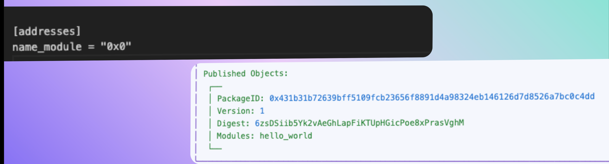
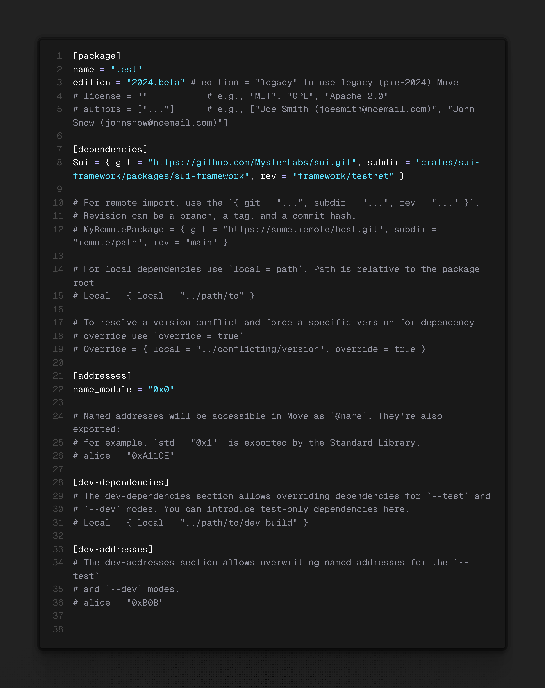

# Các concepts cơ bản trong sui move
- Hiểu về Package structure / Published Package  / Package Manifest
- HIểu về Address / Address type in move / Keys and Addresses
- Hiểu về Transaction structure  /  Transaction Effects


Trong tài liệu này sẽ viết chi tiết về các các khái niệm về package, address, account, và transaction trong Sui. 
Một trong những phần quan trọng trong Sui Move codebase là **Package**. 

---

## Vậy package là gì ? 

Theo định nghĩa từ documentation: 

> Packages are immutable. After you publish a package object on chain to a network, it lives there forever. You cannot directly change the code of an on-chain

Nghĩa là một package là khi được publish trên Blockchain và được xác định là một [address](https://move-book.com/concepts/address.html). Trong package có thể chứa một hoặc nhiều modules. Để hiểu chi tiết về package work thế nào trong Sui, nội dung sẽ được chia thành các phần nhỏ: 
* Package Layout: Cấu trúc của package 
* Published Package: Các package đã được published bạn cần lưu ý 
* Manifest Structure( Move.toml ):  Config file trong sui move contract 
* Artifact    


### Package bao gồm những gì ? (Package Layout)
Một package sẽ chứa nhiều Modules. Trong từng modules đó bao gồm functions, types... 

Đây là ví dụ minh hoạ cho một package layout: 
```
package HELLO_WORLD
    module a
        struct A1
        fun hello_world()
    module b
        struct B1
        fun hello_package()
```

Để tạo package mới, bạn có thể sử dụng lệnh CLI `Sui move new <Name Package>`. Mục đích của Move package system là để cho phép các developer có thể define dễ dàng nơi chứa các move code, bạn có thể import và use packages ở file move code khác.


### Published Package: Các package đã được published bạn cần lưu ý 

Một package khi được published on chain sẽ đi kèm với address đó. Trong môi trường development, Package vẫn sẽ chưa có address mà sẽ mặc định là `0x0`. Cho đến khi package được published thì sẽ nhận được một địa chỉ unique trên mạng blockchain, bao gồm cả chứa bytecode. Package này hoàn toàn là immutable và có thể tương tác tác chạy transactions. 

Ví dụ: 




Để hiểu chi tiết hơn về package và một codebase cho sui move sẽ bao gồm những gì thì ta có là Manifest Structure 


# Manifest Structure( Move.toml ):  Config file trong sui move contract 

Một thư mục source move package sẽ luôn có `Move.toml` - package manifest file bao gồm các metadata cho package đó. File này vô cùng quan trọng vì nó quản lý các dependencies, đảm bảo được môi trường stable cho move project của bạn và để quản lý project. Đây là cấu trúc của một package layout: 


Root của project là tên folder move project của bạn. Trong folder sẽ chứa các files để chạy move project. Trên hình bạn đã thấy các components quan trọng `Move.toml`, `Move.lock` và thư mục `sources`. 

Đối với `Move.toml` và `Move.lock` chịu trách nghiệm trong việc quản lý các dependencies. Còn trong thư mục `Source` là nơi ta thấy các file module.move. Các file này chính là core logic của move code. Ngoài ra, còn có thư mục test. Đây là nơi để bạn có thể viết test case cho move code của bạn đảm bảo dự án chạy như kì vọng và maintain được chất lượng codebase.

Cấu trúc được thiết kế giúp cho các developer có thể quản lý code dễ hơn. Tuy nhiên đây chưa honaf toàn là cấu trúc đầy đủ. Nó còn thêm doc_templates và examples. 

```
Your_Move_Project
├── Move.toml      (required)
├── Move.lock      (generated)
├── sources        (required)
├── doc_templates  (optional)
├── examples       (optional, test & dev mode)
└── tests          (optional, test mode)
```


Sau đây chính là giải thích chi tiết về những thứ trong move project: 

* Move.toml file: Đây là package manifest (mình không biết dịch tiếng việt sao nên hiểu như package.json nhé) chứa các metadata cần thiết cho package. Các thông tin trong package đó bao gồm



* 


### Artifact

Artifact là thứ được tạo ra, nó thể bao gồm data model, diagrams... Trong Sui move, khi package được compiled, nó sẽ generate một directory có tên là `build` chứa các artifacts trong đó, bao gồm bytecode binaries(*mv), source maps `*.mvsm` và tài liệu (`*.md`). 

File `BuildInfo.yaml` chứa các thông tin về build như là version của compiler và thời gian build 


```bash
a_move_package
├── BuildInfo.yaml
├── bytecode_modules
│   ├── dependencies
│   │   ├── <dep_pkg_name>
│   │   │   └── *.mv
│   │   ...
│   │   └──  <dep_pkg_name>
│   │       └── *.mv
│   ...
│   └── *.mv
├── docs
│   ├── dependencies
│   │   ├── <dep_pkg_name>
│   │   │   └── *.md
│   │   ...
│   │   └──  <dep_pkg_name>
│   │       └── *.md
│   ...
│   └── *.md
├── source_maps
│   ├── dependencies
│   │   ├── <dep_pkg_name>
│   │   │   └── *.mvsm
│   │   ...
│   │   └──  <dep_pkg_name>
│   │       └── *.mvsm

│   ...
│   └── *.mvsm
└── sources
    ...
    └── *.move
    ├── dependencies
    │   ├── <dep_pkg_name>
    │   │   └── *.move
    │   ...
    │   └──  <dep_pkg_name>
    │       └── *.move
    ...
    └── *.move


```


Đoạn code package.move: https://github.com/MystenLabs/sui/blob/main/crates/sui-framework/packages/sui-framework/sources/package.move


