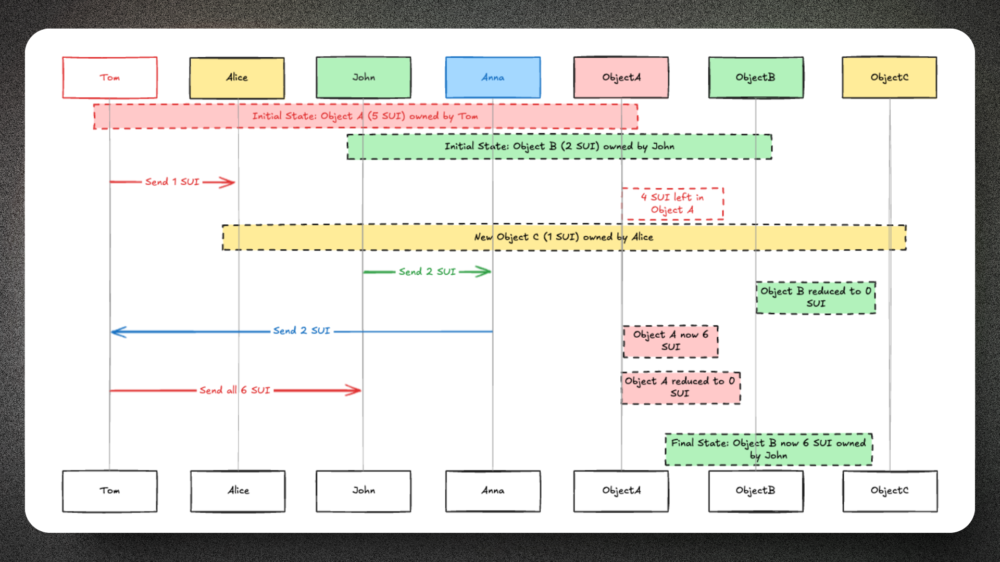
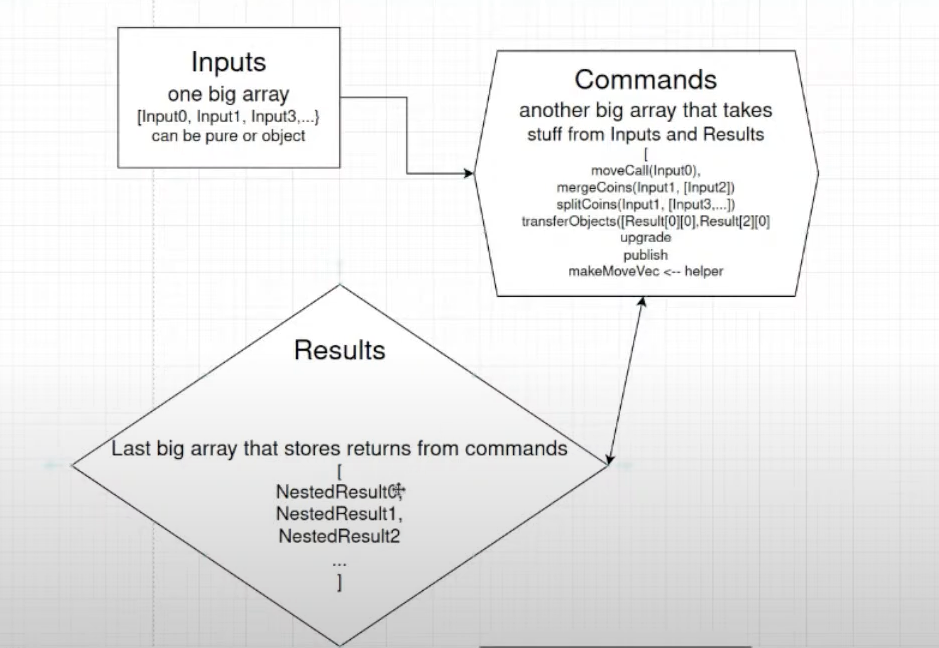
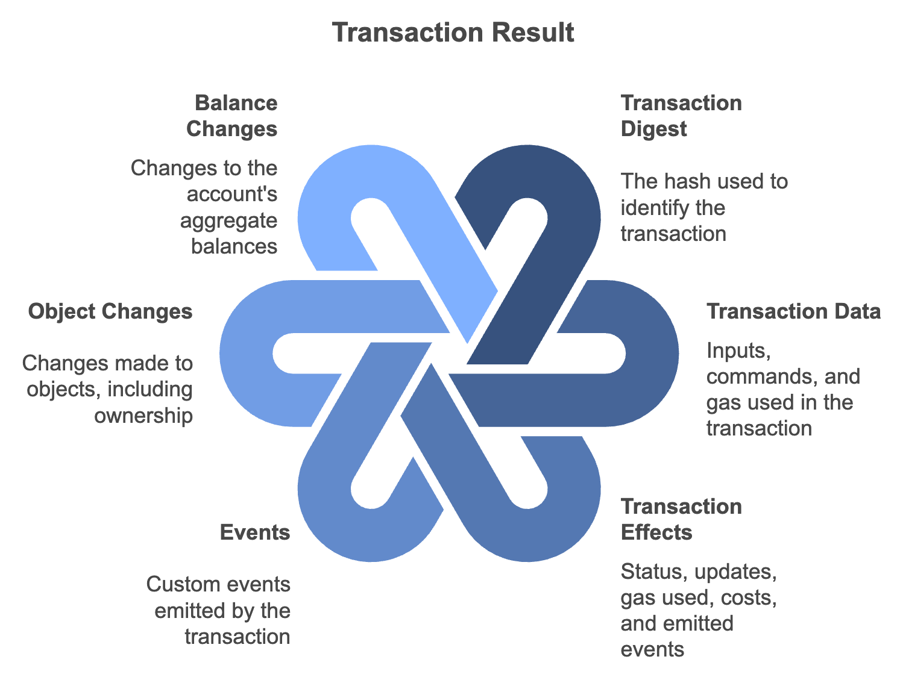

# Transaction trong Sui 
Nội dung sẽ giới thiệu về các loại transactions trên sui và làm thế nào để được executed. 

Transaction là  khái niệm cơ bản trong blockchain và là cách để tương tác với blockchain Sui. Transaction được sử dụng để thay đổi trạng thái (state) của blockchain thông qua việc tương tác với các đối tượng (objects). Trong move, Các transactions được sử dụng để gọi từ call các functions ở trong smart contract, khi publish một packages mới và khi upgrade package đã có sẵn. 

Functions called directly through a transaction typically have an instance of TxContext as the last parameter. This is a special parameter set by the Sui Move VM and does not need to be specified by the user calling the function.

# Các loại Transaction 
Trên Sui, Các data được update thông qua transactions. Sui hỗ trợ 2 loại transaction là: 

1. Programmable transaction blocks (PTB): Bất kì ai cũng có thể gửi các giao dịch này đến mạng. PTBs chứa nhiều commands khác nhau để cùng thực thi ra được outcome của transaction. Bạn có thể call nhiều move functions, quản lý objects và tokens trong một transaction mà không cần phải publish một move package mới. Điều này cho phép user gom lại nhiều lệnh tính toán một lần. Điều này giúp ích lớn cho việc giảm chi phí và tăng thông lượng mạng.

2. System Transactions: Chỉ những người là validator nodes có thể submit những transaction này. Họ chịu trách nghiệm trong việc maintain mạng ban gồm init checkpoint, thay đổi epoch...

## Cấu trúc của transaction 

Toàn bộ Sui transactions đều sẽ có chi tiết những metadata sau:

* Sender address: Địa chỉ của người gửi transaction 
* Gas input: Tham chiếu đến đối tượng sẽ được sử dụng để thanh toán phần phí thực thi và lưu trữ của giao dịch này. 
* Max gas budget: Số đơn vị gas tối đa sẽ được sử dụng để thanh toán transaction này 
* Epoch: Mục tiêu Sui epoch cho giao dịch 
* Type: Loại lệnh call, publish hay giao dịch cùng với dữ liệu cụ thể. 
* Authenticator: Cryptographic signature và public key.
* Expiration Time: Thời hạn mà sau đó các validator sẽ không coi đây là valid transaction

## Ví dụ về transaction flow 

Dưới đấy là một ví dụ về transaction flow 

Giả sử chúng ta có 2 object: 
Object A: là Sui token có balance là 5 Sui do account tên Tom sỡ hữu 
Object B: Chứa 2 Sui do John sỡ hữu 

Theo ví dụ trên thì Tom gửi 1 Sui sang Alice. Object A chính là input cho transaction này và output của transaction là 2 objects: 
* Object changed là object A giờ chỉ còn 4 SUI token 
* Object mới được tạo ra là Object C chứa 1 Sui sỡ hữu bởi Alice 

Cùng lúc đó, John quyết định gửi 2 Sui token sang Alice.  Do hai giao dịch này tương tác với các đối tượng khác nhau, chúng có thể được thực thi song song. Sau khi nhận 2 Sui, Anna quyết định gửi lại cho Tom. Giờ thì Tom đã có 2 tokens. 

Cuối cùng thì Tom  gửi toàn bộ Sui token cho John. Input của transaction này là Object A 

## Transaction Inputs, Commands, Effects ()

Transaction inputs đều là các tham số đầu vào cho transactions. Có 2 kiểu tham số: 

* Pure Agruments : Đây là những tham số kiểu dữ liệu primitive như là bool, address, UTF8 String, `vector<T>`... 
* Object Arguments: Là những object hoặc tham chiếu của object đó. Chi tiết về object model sẽ ở các nội dung tiếp theo

Sui transactions sẽ chứa nhiều commands. Mỗi command có thể là publishing một package hoặc call một function từ package đã được published. Các command đều sẽ chạy theo thứ tự mà đã được đặt trong transaction, Có thể sử dụng output từ command trước để input vào command tiếp theo như mỗi chuỗi ( chain). Đây là ví dụ minh hoạ cho luồng này:

Trong hình trên, ta có sender là `0xa11ce` thực thi các commands sau: 
* Splitcoins - split một coin từ object đã có sẵn, trong trường hợp này là `gas` object. 
* Movecall - Lệnh call function purchase trong package 0xAAA, module `market` với tham số là `payment` objecty
* Transferobjects - Lệnh transfer object sang địa chỉ khác 

Sau khi call thành công, ta sẽ có `Transaction Effects` thể hiện sự thay đổi của một transaction đến state đó. Cụ thể hơn một transaction thay đổi sẽ bao gồm một trong các cách sau: 
* Sử dụng gas object để thanh toán một transaction 
* Tạo, cập nhập hay xoá object đó ( Create, update hoặc delete)
* Phát ra sự kiện ( emit events)

Output của transaction bao gồm nhiều phần như: 
* Transaction digest: Mã hash của transaction
* Transaction data: Thông tin inputs, commands và gas object được dùng trong transaction. 
* Transaction Effect: Trạng thái  và những ảnh hưởng của transactions 
* Events: Các event được phát trong transaction
* Object changes: Các thay đổi của các objects, bao gồm cả tính ownership 
* Balance changes: Những thay đổi đến balances của account trong transaction 

## Lifecycle of a Transaction(optional)
Nếu bạn thắc mắc và muốn tìm hiểu về `Lifecycle of a Transaction` từ lúc tạo ra đến lúc hoàn thành. 

Bạn có thể đọc bài từ [đây](https://docs.sui.io/concepts/sui-architecture/transaction-lifecycle#:~:text=Life%20cycle%20overview%E2%80%8B&text=The%20first%20step%20of%20the,often%20through%20a%20Full%20node)

Đây là ví dụ Payment Transaction minh hoạ ở vòng đời trên: 
1. Creating the transaction: Giả sử bạn muốn thanh toán 10 SUI ở tiệm coffee. Bạn sẽ mở wallet app và scan Qr code, khởi tạo và sign transaction transfer 10 Sui đến địa chỉ tiệm Coffee đó. 
2: Boardcasting the transaction: App Wallet của bạn sẽ submit transaction đến fullnode, nghĩa là sẽ đến tất cả các Validators
3. Authenticating the Transaction: Các validator sẽ check chính xác của transaction này và sign nó, để đảm bảo transaction của bạn là valide hay không 
4. Finalizing the Transaction: Fullnode sẽ broadcasts transaction certificate, validators sẽ validate và execute transaction và trả về Effect
5. Generating the Effects Certificate: Bạn sẽ nhận được bằng chứng là bạn là người làm giao dịch này và đưa cho tiệm coffee bằng chứng là giao dịch bạn thành công. 

# Further reading:
* Bạn có thể xem thêm về profile của một transaction qua Gas profiler tool để biết chi tiết từng cost của mỗi function khi call trên Sui: [Video](https://www.youtube.com/watch?v=UhkaIiD4XHg)
* [Sui Programmable Transactions workshop](https://www.youtube.com/watch?v=X2ogC_uOdZ8)
