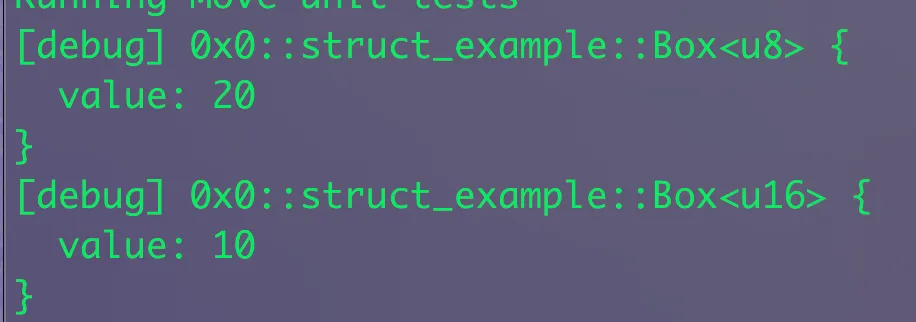

# Generic and Phantom Types (Advanced)

## Generics là gì? 
Hiểu đơn giản từ rust, Generics là một khái niệm sinh ra nhằm tránh việc trùng lặp code khi xử lý một logic cho nhiều kiểu dữ liệu khác nhau. Nó hữu ích khi bạn làm việc với function mà có nhiều kiểu dữ liệu . Generic cũng là một trong advanced features trong move mà mọi người nên biết. 

Trong nội dung ở bài học các kiểu dữ liệu ở sui move, mình đã đề cập đến kiểu `vector`, đây là một dang generic type có thể hold bất kì dữ liệu nào. Một ví dụ khác trong thư viện tiêu chuẩn mà bạn cũng biết là `Option` được dùng để biểu diễn một giá trị có thể có hoặc không cần.

Khi tạo một kiểu dữ liệu hoặc function có generic type, bạn cần liệt kê các tham số generic trong cặp dấu ngoặc nhọn (< và >). Mỗi tham số được ngăn cách với nhau bởi dấu phẩy:


```rust
 // Box struct này chỉ có thể có value là u64. Ta có thể dùng generic 
public struct Box {
    value: u64
} 


// generic struct 
public struct Box<T> {
    value: T
} 
```


Hoặc ví dụ với function: 
```rust
/// Function that creates a new `Container` with a generic value `T`.
public fun new_box<T>(value: T): Box<T> {
    Box { value }
}
```

Trong ví dụ trên, `Box` là một kiểu generic với một tham số kiểu T, trường value của box lưu trữ T. Hàm new_box là một hàm generic với một tham số kiểu T, và nó trả về một `Box` với giá trị được truyền vào.

```rust
   // generic struct 
    public struct Box<T> has drop {
            value: T
    } 


    public fun new_box<T>(value: T): Box<T> {
        Box { value }
    }

    #[test]
    fun test_box(){
    // these three lines are equivalent
    let box = new_box(20u8); // type inference
    debug::print(&box);
    
    let box = new_box<u16>(10); // create a new `Box` with a `u16` value

    assert!(box.value == 10, 0);

    debug::print(&box);
}

```




## Generic structs

Các tham số `<T>` cho struct được đặt sau tên struct và có thể được sử dụng để đặt kiểu dữ liêu cho các kiểu của trường.

```rust

public struct Foo<T> has copy, drop { x: T }

public struct Bar<T1, T2> has copy, drop {
    x: T1,
    y: vector<T2>,
}
```

Chúng ta có thể thêm điều kiện để đảm bảo rằng kiểu dữ liệu được truyền vào generic phải có những khả năng (abilities) nhất định. Cú pháp như sau:

```rust
 public struct Box<T: store + drop> has key, store {
        value: T
    }
```

Điều quan trọng cần lưu ý ở đây là kiểu dữ liệu bên trong `T` trong ví dụ trên phải đáp ứng một số ràng buộc về khả năng do kiểu Box bên ngoài yêu cầu. Trong ví dụ này, `T` phải có khả năng `store`, vì `Box` có cả `store` và `key`. Tuy nhiên, `T` cũng có thể có các khả năng mà box không có, chẳng hạn như `drop` trong ví dụ này. 

Trực quan là nếu box được phép chứa một kiểu **không tuân theo cùng một quy tắc với nó**, box sẽ vi phạm khả năng của chính nó. Làm sao một box có thể lưu trữ được nếu nội dung của nó không thể lưu trữ? Chúng ta sẽ cùng nhau tìm hiểu về kiểu phantom dưới đây

## Sử dụng Generics trong function

Trong ví dụ trên mình đã ví dụ minh hoạ về viết function với generic.  Để viết một hàm trả về một instance của`Box`có thể chấp nhận tham số với bất kỳ kiểu dữ liệu nào cho trường`value`, chúng ta cũng cần sử dụng generics trong định nghĩa hàm. Hàm có thể được định nghĩa như sau:

```rust
public fun create_box<T>(value: T): Box<T> {
        Box<T> { value }
    }
```

Để gọi một hàm có chứa generics trong nó, chúng ta phải chỉ định kiểu dữ liệu trong dấu ngoặc nhọn, theo cú pháp sau:

```rust
// data type của value sẽ là bool
 let bool_box = storage::create_box<bool>(true);
// data type của value sẽ là u64
 let u64_box = storage::create_box<u64>(1000000);
```

Ngoài ra bạn cũng có thể call function với sui cli bằng cách truyền thêm `—type-args`. Ví dụ:

```bash
sui client call --package $PACKAGE --module $MODULE --function "create_box" --args $OBJECT_ID --type-args 0x2::sui::SUI --gas-budget 10000000
```

## Có nhiều tham số T

Bạn có thể định nghĩa một kiểu hoặc function với nhiều tham số. Các tham số được ngăn cách nhau bởi dấu phẩy.

```rust
public struct Pair<T, U> {
    first: T,
    second: U,
}

public fun new_pair<T, U>(first: T, second: U): Pair<T, U> {
    Pair { first, second }
}
```

Trong ví dụ trên, `Pair` là một kiểu generic với hai tham số kiểu `T` và `U`, và hàm `new_pair` là một hàm generic với hai tham số kiểu `T` và `U`. Hàm này trả về một `Pair` với các giá trị được truyền vào. Thứ tự của các tham số  rất quan trọng và phải khớp với thứ tự của các tham số generics.

Mình sẽ viết các hàm test generic:

```rust
#[test]
fun test_generic() {
    // these three lines are equivalent
    let pair_1: Pair<u8, bool> = new_pair(10, true);
    let pair_2 = new_pair<u8, bool>(10, true);
    let pair_3 = new_pair(10u8, true);
    }
  
#[test]
fun test_swap_type_params() {
    let pair1: Pair<u8, bool> = new_pair(10u8, true);
    let pair2: Pair<bool, u8> = new_pair(true, 10u8);
}
  
    
```
## Tại sao cần dùng generics ?

Qua các ví dụ trên, ta đã học cách tạo và sử dụng các kiểu generic cơ bản. Nhưng generic còn có một ưu điểm quan trọng hơn: nó cho phép chúng ta viết code một lần và dùng được cho nhiều kiểu dữ liệu khác nhau. Điều này rất tiện lợi, đặc biệt khi làm việc với các tập hợp dữ liệu (collections) và các tính năng nâng cao trong Move.

```rust
public struct User<T> {
    name: String,
    age: u8,
    /// Nhiều ứng dụng 
    metadata: T,
}
```

In the example above, `User` is a generic type with a single type parameter `T`, with shared fields `name` and `age`, and the generic `metadata` field which can store any type. No matter what the `metadata` is, all of the instances of `User` will have the same fields and methods.

Trong ví dụ trên, `User` là một kiểu dữ liệu generic với một tham số kiểu `T`, có các trường chung là `name` và `age`, và trường generic `metadata` có thể lưu trữ bất kỳ kiểu dữ liệu nào. Dù `metadata` là gì đi nữa, tất cả các thể hiện của `User` đều sẽ có cùng các trường và phương thức.


## Phantom type 

Phantom generics là các tham số generic không được sử dụng trong các trường hoặc phương thức của struct.


```Rust
// A generic type with a phantom type parameter.
public struct Coin<phantom T> {
    value: u64
}
```

Ví dụ chúng ta tạo một  Coin không sử dụng tham số kiểu T trong bất kỳ trường hay phương thức nào. Nó chỉ dùng để phân biệt giữa các loại coin khác nhau và áp đặt các ràng buộc lên tham số kiểu T. 


```rust 
public struct USD {}
public struct EUR {}

#[test]
fun test_phantom_type() {
    let coin1: Coin<USD> = Coin { value: 10 };
    let coin2: Coin<EUR> = Coin { value: 20 };

    // Unpacking is identical because the phantom type parameter is not used.
    let Coin { value: _ } = coin1;
    let Coin { value: _ } = coin2;
}
```