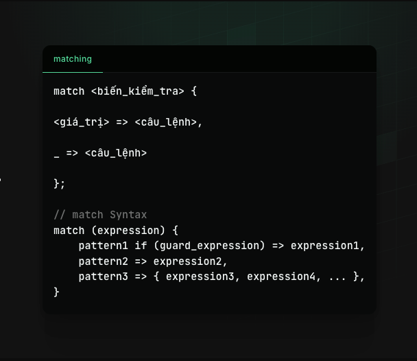

# Control flow trong sui move hoạt động như thế nào ? 

Trong trang này, bạn sẽ tìm hiểu về các control flows trong Sui. Control flow là rất quan trọng trong ngôn ngữ lập trình. Dịch ra tiếng việt là cấu trúc điều khiển flow thực thi trong chương trình bao gồm việc ra quyết định chạy, lặp lại các đoạn code hay thực thi đoạn code này sớm hơn. 

## Move có các control flow statements sau: 
1. `if` và `else` sẽ quyết định khi nào thực thi một code block trong đó.
2. `loop` và `while` lặp lại một code block 
3. `break` và `continue` chính là điều kiện dừng. Exit một vòng lặp sớm 
4. `return` sẽ trả giá trị và kết thúc function sớm.

Sau đây chúng ta sẽ thảo luận sâu về những statement này: 

### Câu điều kiện if-else 

Câu điền kiện if-else cho phép bạn chạy một đoạn code block dựa trên điều kiện mà bạn xác định là đúng(true) hay sai(false). Nếu điều kiện sai thì sẽ chuyễn đoạn block khác. Cú pháp của if-else như sau: 
```rust
if (<bool_expression>) {
	<expression> 
} else {
	<expression>
};
```

Ví dụ về cách if-else:
```rust

#[test] 
    fun test_if_else(){
        let x = 7;
        
        // // thay vi viet nhu the nay 
        // if(x> 0){
        //     y = 1;
        // } else {
        //     y = 0;
        // }

        // ta co the viet the nay 
        
        let y = if (x < 5) {
            1
        } else if (x < 10 && x > 5){
            2
         } else {
            3
         };
        
        debug::print(&y)
    }

```


Cùng xem ví dụ dưới đây, nếu `a` là true thì `b` sẽ lấy giá trị 10, ngược lại thì `b` sẽ lấy giá trị 20. 

```rust

module sui_bootcamp::example_if {
	use sui::object::UID;
	use sui::tx_context::{Self, TxContext};
    use sui::transfer;

	// Declaring the ExampleObject
	public struct ExampleObject has key, store {
		id: UID,
		num: u8,
	}

	// Initializing the constructor
	fun init(ctx: &mut TxContext) {

		// Try switching to false
		let a = true;

		let b = if (a) {
			10
		} else {
			20
		};
		
		let obj = ExampleObject{
			id: object::new(ctx),
			num: b,
		};

        transfer::public_transfer(obj, ctx.sender());
	}
}

```

### Câu lệnh lặp
Lệnh lặp `loop` rất quan trọng vì nó sẽ giúp thực thi các tasks lặp đi lặp lại theo hướng automation. Tuy nhiên phải lưu ý khi chạy vòng lặp có thể dẫn đến vòng lặp vô hạn `infinite loop`. Nếu trên blockchain, thì chắc shắn sẽ dẫn đến việc hết phí gas vì thế mà sẽ cần các phần điều kiện để thoát khỏi vòng lặp. 

Syntax loop: 

```
while (<bool_expression>) { <expressions>; };

loop { <expressions>; };

```

```rust
 #[test]
    fun test_loop(mut x: u64){
        //loop until x = 5
        loop {
            x = x + 1;
        
            if (x == 5){ 
                break  // exit 
            }
        }

    }
```


### Exit khỏi vòng lặp 

Một vòng lặp có thể thực thi để đạt được kết quả như kì vọng. Khi điều kiện của vòng lặp đã đạt, vòng lặp sẽ kết thúc. Để dừng vòng lặp này ta có thể sử dụng `break`. Tuy nhiên nếu chỉ muốn skip cái cái vòng lặp hiện tại và chuyển tiếp vòng lặp tiếp theo thì `continue`


```rust
#[test]
    fun test_continue() {
        let mut x = 0;
    
        // This will loop x equals 10.
        loop {
            x = x + 1;
    
            if (x % 2 == 1) {
                continue // Skip 
            };
            std::debug::print(&x);
    
            // If "x" is 10 then exit the loop.
            if (x == 10) {
                break // Exit loop
            }
        };
    }
```


### Return 

Sau khi đạt được kết quả mong muốn, bạn có thể sử dụng `return` để thoát khỏi hàm sớm và trả về một giá trị. Cú pháp như sau:

```rust 
return <expression>
```


```rust
/// This function returns `true` if `x` is greater than 0 and not 5.
fun is_positive(x: u8): bool {
	if (x == 5) {
		return false
	};

	if (x > 0) {
		return true
	};

	false
}

```


## Pattern Matching 

Câu lệnh match có chức năng tương tự với câu lệnh switch trong các ngôn ngữ khác vậy. Câu lệnh match sẽ kiểm tra xem một biến có giá trị bằng một giá trị nào đó hay không, nếu có thì thực hiện các câu lệnh tương ứng. Cú pháp của câu lệnh match như sau:



Lệnh match có hai phần chính: một biểu thức cần kiểm tra và một danh sách các trường hợp (được ngăn cách bởi dấu phẩy). Mỗi trường hợp gồm có:

- Một mẫu so khớp (`p`)
- Một điều kiện không bắt buộc (`if (g)`, với `g` là điều kiện đúng/sai)
- Dấu mũi tên (`=>`)
- Một biểu thức (`e`) sẽ chạy khi tìm thấy trường hợp phù hợpớp. 


Ví dụ: 

```rust
fun run(x: u64): u64 {
    match (x) {
        1 => 2,
        2 => 3,
        x => x,
    }
}

run(1); // returns 2
run(2); // returns 3
run(3); // returns 3
run(0); // returns 0

```

Nội dung của Pattern sẽ sẽ được viết chi tiết hơn trong mục Enum để hiểu sâu về các cấu trúc trong sui move.


### Labels 
Ta có thể dùng `break` và `continue` ở các vòng lặp bên ngoài (outer loops) trong khi xử lý vòng lặp bên trong (inner loops). Trong những trường hợp này, các vòng lặp phải được chú thích bằng nhãn `'label`

Khi sử dụng `Labels`, ta có thể làm cho quá trình thực thi nhảy từ câu lệnh này sang câu lệnh khác. Labels được khai báo bằng `'label_name`: 

```rust
'increment: block_of_code
```

Ví dụ: 


```rust 

'outer: loop { 
    debug::print(b"The outer lôp".to_string());

    'inner: loop {
        debug::print(b"The inner loop".to_string());

        // lệnh break dứoi này chỉ có thể break ở vòng lặp bên trong do không có nhãn 
        //break


        // lệnh này sẽ break vòng lặp ở bên ngoài 
        break 'outer;
    }   

    debug::print(b"Inf loop".to_string());

}
```


