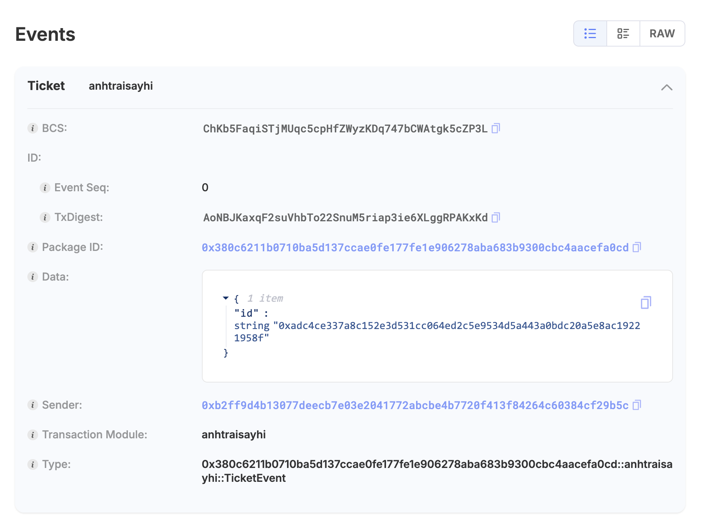
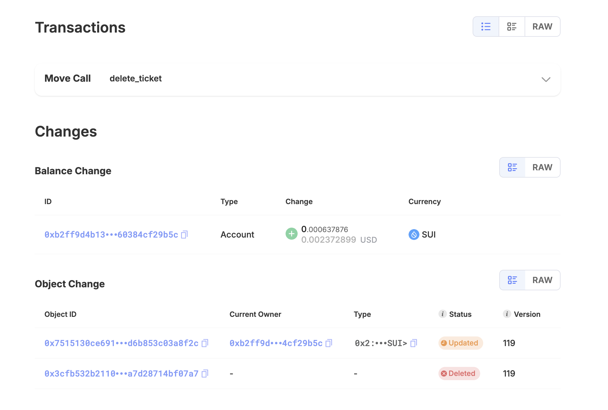

## Events 


### Events là gì ? 

+ Event là cách để module có thể tương tác với frontend qua blockchain, một thuật ngữ gọi là "listenning" cho các events và biết các action ở smart contract đang diễn ra. Nếu không có event thì sẽ rất khó để bạn có thể monitor khi mà có một object được tạo ra, được cập nhập... 
+ Event có thể query kết quả của các objects đã thay đổi như thế nào
+ Event cũng là 1 object 

### Ví dụ 
+ tạo một ticket cho chương trình `Anh Trai Say Hi`


```rust
module sui_bootcamp::anhtraisayhi {
 
    use sui::event;
 
 
    public struct AnhtraisayhiTicket has key {
        id: UID,
 
    }
 
    // struct ticket 
    public struct TicketEvent has copy, drop{
        id: ID
    }
 
 
    // create ticket 
    public entry fun create_ticket(ctx: &mut TxContext){
 
        let uid = object::new(ctx);
        let id = object::uid_to_inner(&uid);
 
        // ta cần dùng `object::uid_to_inner` để convert từ UID type sang ID type.
        let ticket = AnhtraisayhiTicket {
            id: uid
        };
 
       
        transfer::transfer(ticket, tx_context::sender(ctx));
        // Sử dụng lệnh `event::emit` để phát event
        event::emit(TicketEvent {
         id,
     });
   
    }
 
}

```

### Cách xem logs event 
Vận dụng kiến thức đã học ở [Sui CLI](../hello_move/hello_world_move.mdx) để publish và gọi hàm `create_ticket`

+ Publish `sui_bootcamp` package 

```bash
sui client publish --gas-budget 10000000
```
<details>
  <summary>Kết quả</summary>
    ```bash
Transaction Digest: 68FycyoBKDtN2rSxYNLRRwyYQbNXrq5Vz1EgBcV5Wnzo
╭──────────────────────────────────────────────────────────────────────────────────────────────────────────────╮
│ Transaction Data                                                                                             │
├──────────────────────────────────────────────────────────────────────────────────────────────────────────────┤
│ Sender: 0xb2ff9d4b13077deecb7e03e2041772abcbe4b7720f413f84264c60384cf29b5c                                   │
│ Gas Owner: 0xb2ff9d4b13077deecb7e03e2041772abcbe4b7720f413f84264c60384cf29b5c                                │
│ Gas Budget: 10000000 MIST                                                                                    │
│ Gas Price: 1000 MIST                                                                                         │
│ Gas Payment:                                                                                                 │
│  ┌──                                                                                                         │
│  │ ID: 0x7515130ce691e746fb4f74147481d0f0552dc714781fdbadb4d6b853c03a8f2c                                    │
│  │ Version: 114                                                                                              │
│  │ Digest: AqBNBGX5GnCsJcU4ZpULF1EqKr1uJ4o7YJ7w3mJ85GNK                                                      │
│  └──                                                                                                         │
│                                                                                                              │
│ Transaction Kind: Programmable                                                                               │
│ ╭──────────────────────────────────────────────────────────────────────────────────────────────────────────╮ │
│ │ Input Objects                                                                                            │ │
│ ├──────────────────────────────────────────────────────────────────────────────────────────────────────────┤ │
│ │ 0   Pure Arg: Type: address, Value: "0xb2ff9d4b13077deecb7e03e2041772abcbe4b7720f413f84264c60384cf29b5c" │ │
│ ╰──────────────────────────────────────────────────────────────────────────────────────────────────────────╯ │
│ ╭─────────────────────────────────────────────────────────────────────────╮                                  │
│ │ Commands                                                                │                                  │
│ ├─────────────────────────────────────────────────────────────────────────┤                                  │
│ │ 0  Publish:                                                             │                                  │
│ │  ┌                                                                      │                                  │
│ │  │ Dependencies:                                                        │                                  │
│ │  │   0x0000000000000000000000000000000000000000000000000000000000000001 │                                  │
│ │  │   0x0000000000000000000000000000000000000000000000000000000000000002 │                                  │
│ │  └                                                                      │                                  │
│ │                                                                         │                                  │
│ │ 1  TransferObjects:                                                     │                                  │
│ │  ┌                                                                      │                                  │
│ │  │ Arguments:                                                           │                                  │
│ │  │   Result 0                                                           │                                  │
│ │  │ Address: Input  0                                                    │                                  │
│ │  └                                                                      │                                  │
│ ╰─────────────────────────────────────────────────────────────────────────╯                                  │
│                                                                                                              │
│ Signatures:                                                                                                  │
│    V3eudPOH1ArAqOXS2z9+z50W2xcXHamB9RexNRfzMKEaVy8WHJbB2kx/FVHiIAe+6AGTcBM6zJZxnI7qU/O8Aw==                  │
│                                                                                                              │
╰──────────────────────────────────────────────────────────────────────────────────────────────────────────────╯
╭───────────────────────────────────────────────────────────────────────────────────────────────────╮
│ Transaction Effects                                                                               │
├───────────────────────────────────────────────────────────────────────────────────────────────────┤
│ Digest: 68FycyoBKDtN2rSxYNLRRwyYQbNXrq5Vz1EgBcV5Wnzo                                              │
│ Status: Success                                                                                   │
│ Executed Epoch: 39                                                                                │
│                                                                                                   │
│ Created Objects:                                                                                  │
│  ┌──                                                                                              │
│  │ ID: 0x380c6211b0710ba5d137ccae0fe177fe1e906278aba683b9300cbc4aacefa0cd                         │
│  │ Owner: Immutable                                                                               │
│  │ Version: 1                                                                                     │
│  │ Digest: BAArMd6SnSezMar54mKEUfPytsnCLhnm3Cwy7zDkWnTC                                           │
│  └──                                                                                              │
│  ┌──                                                                                              │
│  │ ID: 0xfbcfd73dea926b26cf1c07adb24ad9e25502818ca7b9533d8d7e0c63e88e5d7d                         │
│  │ Owner: Account Address ( 0xb2ff9d4b13077deecb7e03e2041772abcbe4b7720f413f84264c60384cf29b5c )  │
│  │ Version: 115                                                                                   │
│  │ Digest: Aup8Y361Ei6oW8XnoNiAuGkmu12FUtnU65Doa8Mfcv1U                                           │
│  └──                                                                                              │
│ Mutated Objects:                                                                                  │
│  ┌──                                                                                              │
│  │ ID: 0x7515130ce691e746fb4f74147481d0f0552dc714781fdbadb4d6b853c03a8f2c                         │
│  │ Owner: Account Address ( 0xb2ff9d4b13077deecb7e03e2041772abcbe4b7720f413f84264c60384cf29b5c )  │
│  │ Version: 115                                                                                   │
│  │ Digest: 3qVcxqosrxFPs5m9WPD83F2MCbJ3L1WZHJkJmkV7ajXV                                           │
│  └──                                                                                              │
│ Gas Object:                                                                                       │
│  ┌──                                                                                              │
│  │ ID: 0x7515130ce691e746fb4f74147481d0f0552dc714781fdbadb4d6b853c03a8f2c                         │
│  │ Owner: Account Address ( 0xb2ff9d4b13077deecb7e03e2041772abcbe4b7720f413f84264c60384cf29b5c )  │
│  │ Version: 115                                                                                   │
│  │ Digest: 3qVcxqosrxFPs5m9WPD83F2MCbJ3L1WZHJkJmkV7ajXV                                           │
│  └──                                                                                              │
│ Gas Cost Summary:                                                                                 │
│    Storage Cost: 8390400 MIST                                                                     │
│    Computation Cost: 1000000 MIST                                                                 │
│    Storage Rebate: 978120 MIST                                                                    │
│    Non-refundable Storage Fee: 9880 MIST                                                          │
│                                                                                                   │
│ Transaction Dependencies:                                                                         │
│    6ycteXKX4AdmMiEgnXwJqKpedyJwFxvdqo1rsFcLwQEm                                                   │
│    7LEYZdAitBtdzxrPBGQx4TckZDjRwkRsErD8vj49QmXH                                                   │
╰───────────────────────────────────────────────────────────────────────────────────────────────────╯
╭─────────────────────────────╮
│ No transaction block events │
╰─────────────────────────────╯

╭──────────────────────────────────────────────────────────────────────────────────────────────────╮
│ Object Changes                                                                                   │
├──────────────────────────────────────────────────────────────────────────────────────────────────┤
│ Created Objects:                                                                                 │
│  ┌──                                                                                             │
│  │ ObjectID: 0xfbcfd73dea926b26cf1c07adb24ad9e25502818ca7b9533d8d7e0c63e88e5d7d                  │
│  │ Sender: 0xb2ff9d4b13077deecb7e03e2041772abcbe4b7720f413f84264c60384cf29b5c                    │
│  │ Owner: Account Address ( 0xb2ff9d4b13077deecb7e03e2041772abcbe4b7720f413f84264c60384cf29b5c ) │
│  │ ObjectType: 0x2::package::UpgradeCap                                                          │
│  │ Version: 115                                                                                  │
│  │ Digest: Aup8Y361Ei6oW8XnoNiAuGkmu12FUtnU65Doa8Mfcv1U                                          │
│  └──                                                                                             │
│ Mutated Objects:                                                                                 │
│  ┌──                                                                                             │
│  │ ObjectID: 0x7515130ce691e746fb4f74147481d0f0552dc714781fdbadb4d6b853c03a8f2c                  │
│  │ Sender: 0xb2ff9d4b13077deecb7e03e2041772abcbe4b7720f413f84264c60384cf29b5c                    │
│  │ Owner: Account Address ( 0xb2ff9d4b13077deecb7e03e2041772abcbe4b7720f413f84264c60384cf29b5c ) │
│  │ ObjectType: 0x2::coin::Coin<0x2::sui::SUI>                                                    │
│  │ Version: 115                                                                                  │
│  │ Digest: 3qVcxqosrxFPs5m9WPD83F2MCbJ3L1WZHJkJmkV7ajXV                                          │
│  └──                                                                                             │
│ Published Objects:                                                                               │
│  ┌──                                                                                             │
│  │ PackageID: 0x380c6211b0710ba5d137ccae0fe177fe1e906278aba683b9300cbc4aacefa0cd                 │
│  │ Version: 1                                                                                    │
│  │ Digest: BAArMd6SnSezMar54mKEUfPytsnCLhnm3Cwy7zDkWnTC                                          │
│  │ Modules: anhtraisayhi                                                                         │
│  └──                                                                                             │
╰──────────────────────────────────────────────────────────────────────────────────────────────────╯
╭───────────────────────────────────────────────────────────────────────────────────────────────────╮
│ Balance Changes                                                                                   │
├───────────────────────────────────────────────────────────────────────────────────────────────────┤
│  ┌──                                                                                              │
│  │ Owner: Account Address ( 0xb2ff9d4b13077deecb7e03e2041772abcbe4b7720f413f84264c60384cf29b5c )  │
│  │ CoinType: 0x2::sui::SUI                                                                        │
│  │ Amount: -8412280                                                                               │
│  └──                                                                                              │
╰───────────────────────────────────────────────────────────────────────────────────────────────────╯

    ```
</details>


+ Dùng SUI CLI để gọi hàm `create_ticket`  


Lưu ý: Lấy `packageId` từ `published package` ở trên

```bash
sui client call --module anhtraisayhi --function create_ticket --package 0x380c6211b0710ba5d137ccae0fe177fe1e906278aba683b9300cbc4aacefa0cd --gas-budget 100000000
```

#### Xem thông tin events trên terminal sau khi call hàm `create_ticket`

```bash
...
╭─────────────────────────────────────────────────────────────────────────────────────────────────────────────╮
│ Transaction Block Events                                                                                    │
├─────────────────────────────────────────────────────────────────────────────────────────────────────────────┤
│  ┌──                                                                                                        │
│  │ EventID: AoNBJKaxqF2suVhbTo22SnuM5riap3ie6XLggRPAKxKd:0                                                  │
│  │ PackageID: 0x380c6211b0710ba5d137ccae0fe177fe1e906278aba683b9300cbc4aacefa0cd                            │
│  │ Transaction Module: anhtraisayhi                                                                         │
│  │ Sender: 0xb2ff9d4b13077deecb7e03e2041772abcbe4b7720f413f84264c60384cf29b5c                               │
│  │ EventType: 0x380c6211b0710ba5d137ccae0fe177fe1e906278aba683b9300cbc4aacefa0cd::anhtraisayhi::TicketEvent │
│  │ ParsedJSON:                                                                                              │
│  │   ┌────┬────────────────────────────────────────────────────────────────────┐                            │
│  │   │ id │ 0xadc4ce337a8c152e3d531cc064ed2c5e9534d5a443a0bdc20a5e8ac19221958f │                            │
│  │   └────┴────────────────────────────────────────────────────────────────────┘                            │
│  └──                                                                                                        │
╰─────────────────────────────────────────────────────────────────────────────────────────────────────────────╯
...
```

#### Xem trên Sui scan 





## Errors là gì?

Errors là lỗi xảy ra trong quá trình chạy code, Move cung cấp các lỗi được định nghĩa sẵn để developer có thể sử dụng. 


### Cách định nghĩa errors trong Move 

```rust
    const <Tên lỗi> : u64 = <số thứ tự thường bắt đầu từ số 0>;
```


### Ví dụ 

Tạo thêm 1 hàm `delete_ticket` để xoá ticket đã tạo -> Chỉ có creator của ticket thì mới có quyền xoá ticket

```rust
    //file: anhtraisayhi.move
module sui_bootcamp::anhtraisayhi {
 
    use sui::event;
    
    // định nghĩa lỗi - không phải là owner/creator
    const ENotOwner: u64 = 0;

    public struct AnhtraisayhiTicket has key {
        id: UID,
        creator: address,
 
    }
 
    // struct ticket 
    public struct TicketEvent has copy, drop{
        id: ID,
    }
 
 
    // create ticket 
    public entry fun create_ticket(ctx: &mut TxContext){
 
        let uid = object::new(ctx);
        let id = object::uid_to_inner(&uid);
 
        let ticket = AnhtraisayhiTicket {
            id: uid,
            creator: tx_context::sender(ctx)
        };
 
       
        transfer::transfer(ticket, tx_context::sender(ctx));
        event::emit(TicketEvent {
         id,
     });
   
    }

    // delete ticket 

    public entry fun delete_ticket(ticket: AnhtraisayhiTicket, ctx: &mut TxContext) {

        // chỉ có creator mới thực hiện được delete
        assert!(ticket.creator == tx_context::sender(ctx), ENotOwner);

        let AnhtraisayhiTicket {
            id,
            creator,
        } = ticket;

        object::delete(id)

    }
 
}
```


### Thực thi hàm delete ticket khi là creator 

+ Build sau đó publish package 

```bash
sui move build
```

```bash
sui client publish --gas-budget 10000000
```

Ta có kết qủa `packageId`

```bash
... 
│ Published Objects:                                                                               │
│  ┌──                                                                                             │
│  │ PackageID: 0x298b256ab728cce18d7819b1a2a4f1131b30078fcf7acc83b485d9a1c67ff61c                 │
│  │ Version: 1                                                                                    │
│  │ Digest: 8wAHhqQMHWSq8arUHhkfTZ4cUkHZ3Pwt6XqXnkgAZTTj                                          │
│  │ Modules: anhtraisayhi                                                                         │
│  └──                                                                                             │
╰──────────────────────────────────────────────────────────────────────────────────────────────────╯
...
```

+ Create a ticket 
```bash
sui client call --module anhtraisayhi --function create_ticket --package 0x298b256ab728cce18d7819b1a2a4f1131b30078fcf7acc83b485d9a1c67ff61c --gas-budget 100000000
```

Sau khi call hàm `create_ticket` ta sẽ có một object mới được tạo đó chính là `AnhtraisayhiTicket`


```bash
...
╭──────────────────────────────────────────────────────────────────────────────────────────────────────────────────────╮
│ Object Changes                                                                                                       │
├──────────────────────────────────────────────────────────────────────────────────────────────────────────────────────┤
│ Created Objects:                                                                                                     │
│  ┌──                                                                                                                 │
│  │ ObjectID: 0x3cfb532b21102b8887df0dcedf080486b2d1b0971131064501a7d28714bf07a7                                      │
│  │ Sender: 0xb2ff9d4b13077deecb7e03e2041772abcbe4b7720f413f84264c60384cf29b5c                                        │
│  │ Owner: Account Address ( 0xb2ff9d4b13077deecb7e03e2041772abcbe4b7720f413f84264c60384cf29b5c )                     │
│  │ ObjectType: 0x298b256ab728cce18d7819b1a2a4f1131b30078fcf7acc83b485d9a1c67ff61c::anhtraisayhi::AnhtraisayhiTicket  │
│  │ Version: 118                                                                                                      │
│  │ Digest: 7XEJ7mreJfsxTEkZ3S6VutXF94p3d1293ei1wdXEecfE                                                              │
│  └──                                                                                                                 │
....                                                                                                              │
╰──────────────────────────────────────────────────────────────────────────────────────────────────────────────────────╯
...
```


+ Delete ticket 

Để call hàm này thì ta có thêm `--arg` là `objectId` của ticket vừa tạo


```bash
sui client call --module anhtraisayhi --function delete_ticket --args 0x3cfb532b21102b8887df0dcedf080486b2d1b0971131064501a7d28714bf07a7 --package 0x298b256ab728cce18d7819b1a2a4f1131b30078fcf7acc83b485d9a1c67ff61c --gas-budget 100000000
```


+ Kết quả sau khi gọi hàm `delete_ticket` 





### Thực thi hàm delete ticket khi không phải là creator 


+ Bước 1: Sử dụng account A để gọi hàm `create_ticket` để tạo ticket 

Trong trường hợp của mình là 0xb2ff9d4b13077deecb7e03e2041772abcbe4b7720f413f84264c60384cf29b5c

```bash╭───────────────────┬────────────────────────────────────────────────────────────────────┬────────────────╮
│ alias             │ address                                                            │ active address │
├───────────────────┼────────────────────────────────────────────────────────────────────┼────────────────┤
│ nifty-alexandrite │ 0xb2ff9d4b13077deecb7e03e2041772abcbe4b7720f413f84264c60384cf29b5c │ *              │
│ lucid-sphene      │ 0xd51d17a672dfd63b91c1c555542f8151126f5e0872b85553644730c2471fdf28 │                │
╰───────────────────┴────────────────────────────────────────────────────────────────────┴────────────────╯
```


+ Bước 2: Switch sang account B 

Trong trường hợp của mình là `0xd51d17a672dfd63b91c1c555542f8151126f5e0872b85553644730c2471fdf28`

```bash
sui client switch --address 0xd51d17a672dfd63b91c1c555542f8151126f5e0872b85553644730c2471fdf28
```


+ Bước 3: Sử dụng account B để gọi hàm `delete_ticket` với objectId vừa tạo

```bash
sui client call --module anhtraisayhi --function delete_ticket --args <ticket object id> --package 0x298b256ab728cce18d7819b1a2a4f1131b30078fcf7acc83b485d9a1c67ff61c --gas-budget 100000000
```

Kết quả:
```
RPC call failed: ErrorObject { code: ServerError(-32002), message: "Transaction validator signing failed due to issues with transaction inputs, please review the errors and try again:\n- 
Transaction was not signed by the correct sender: Object 0x74d997bd3275078f6e114c01a42291dbb578fdc14ba205995196ff5520603f87 is owned by account address 0xb2ff9d4b13077deecb7e03e2041772abcbe4b7720f413f84264c60384cf29b5c,
but given owner/signer address is 0xd51d17a672dfd63b91c1c555542f8151126f5e0872b85553644730c2471fdf28", data: None }

```


