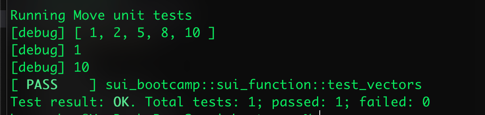
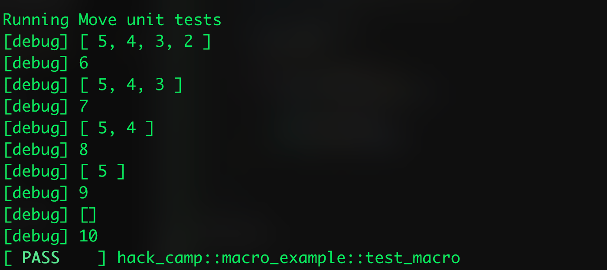

# Function trong sui move 

Function chính là những đoạn code được tái sử dụng để có thể đem đi gọi từ các functions khác hoặc dùng như entry point để chạy chương trình. 


## Khai báo Function 

Từ `fun` là từ khóa để khai báo function trong sui move. Đây là cấu trúc function trong module: 

```rust
module sui_bootcamp::function_example {

	fun add_number(num_1: u64, num_2: u64) {
		let sum = num_1 + num_2;
	}
}
```


Một function sẽ bao gồm: 

* Visibility modifiers 
* Entry modifiers(optional)
* Tên function 
* type parameters( optional)
* parameter lists 
* return type 
* Function function_body

Một function cơ bản sẽ có syntax như sau

```rust
<visibility>? <entry>? fun <identifier><[type_parameters: constraint],*>([identifier: type],*): <return_type> <function_body>
``` 

Ví dụ như đoạn code mẫu dưới đây có tên hàm là `foo`. Các generics type là `T1` và `T2` và hàm này trả về tuple. Trong hàm này chưa có impment logic gì mà chỉ đơn giản là trả về tham số đầu vào.


Đoạn code ví dụ tìm min và max trong một vector: 
```rust
module sui_bootcamp::sui_function {

    use std::vector;
    use std::debug;

    // find maximum & minium values in vector

    public fun vector_min_max(vec: &mut vector<u64>): (u64, u64){
        let mut min = vector::pop_back(vec);
        let mut max = min;

        loop {
            if (vector::is_empty(vec)) break;

            let val = vector::pop_back(vec);
            if(val < min) min = val;
            if (val > max) max = val
        };

        (min, max)
    }

    #[test]
    public fun test_vectors(){
        let mut vec = vector[1, 2, 5, 8 , 10];
        debug::print(&vec);
        
        let (min, max) = vector_min_max(&mut vec);

        debug::print(&min);
        debug::print(&max);

    }

```

Kết quả là:



## Functions visibility 

Tiếp theo bạn sẽ cần hiểu về Visibility - những loại functions có trong Sui Move. Ví dụ sẽ có những module có thể call được function từ module khác và một số thì không. Một trong những cái visibility mà mọi người thường biết là: `private` và `public`. 

Các functions trong module chỉ có thể được gọi trong module đó. Những internal function này được gọi chung là private functions. Để cho phép các modules khác có thể access function, bạn cần phải dùng `public` hoặc `public(package)` để có các function này là public:


* Private function: Nghĩa là các function chỉ có thể access trong module. Đây là ví dụ: 

```rust 
module sui_bootcamp::private_function {
	use sui::object::UID;
	use sui::tx_context::{Self, TxContext};

	// std::string import
	use std::string::{Self, String};

	// Declaring the Name
	struct Numbers has key {
		id: UID,
		a: u8,
		b: u8,
	}

	// Initializing the constructor
	fun init(a: u8, b: u8, ctx: &mut TxContext) {
		let numbers = Numbers {
			id: object::new(ctx),
			name: string::utf8(name_bytes)
		}
	}

	fun add(n: Numbers) {
		let sum = n.a + n.b;
	}
}
```

`add` là private function


* Public function: 

Với public function, có thể call từ các module bên ngoài: 

```rust
module examples::math {
	use sui::object::UID;
	use sui::tx_context::{Self, TxContext};

	// std::string import
	use std::string::{Self, String};

	// Declaring the Name
	struct Numbers has key {
		id: UID,
			a: u8,
			b: u8,
	}

	// Initializing the constructor
	fun new(num_1: u8, num_2: u8, ctx: &mut TxContext) {
		let numbers = Numbers {
			id: object::new(ctx),
				a: num_1,
				b: num_2,
		}
	}

	fun add(n: Numbers) {
		let sum = n.a + n.b;
	}

	public fun sub(n: Numbers){
		let result = n.a - n.b;
	}
}
```


* Package public functions: Nếu bạn chỉ muốn gọi các functions ở trong các module khác mà chung một package ( chung địa chỉ address) thì `public(package)` sẽ giúp bạn điều đó: 


Code Example:
```rust

module sui_bootcamp::target {

    public fun foo(): u64 { 42 }

    public(package) fun bar(): u64 { 44 }
}


module sui_bootcamp::caller {
    use std::debug;

    #[test]
    fun test_calls_target() {
        let res1 = sui_bootcamp::target::foo();
        let res2 = sui_bootcamp::target::bar();

        
        debug::print(&res1);
        debug::print(&res2);
    }

```


* Entry functions 

Trong sui move, một trong những hoạt động cơ bản là chuyển đối tượng. Khi bạn thực hiện một giao dịch, hàm `entry` cần được gọi trực tiếp. Để khởi tạo một hàm `entry`, chúng ta cần đảm bảo ba điều sau:

* Function đó cần có `entry`
* Function sẽ không có giá trị trả về 
* Tham số của entry function phải có là `TxContext`  

Đây là ví dụ cho entry function:

```rust 
public entry fun mint(ctx: &mut TxContext) {

    let object = HelloWorldObject {
        id: object::new(ctx),
        text: string::utf8(b"Hello World!")
    };

    transfer::public_transfer(object, tx_context::sender(ctx));
}

```

`&mut TxContext` chính là biến tham chiếu có thể thay đổi được giúp cho việc biết địa chỉ sender là ai để mint được contract này. Trong đó hàm transfer ở cuối function không phải trả về bất kì giá trị gì mà giúp store object vào địa chỉ sender sau khi publish module.


## Function call

Để gọi function bạn chỉ cần cung cấp các tham số tương ứng đúng với Agurments mà bạn đã defined. Các tham số vừa có thể là các giá trị mà bạ truyền vào và cũng có thể là các kết quả của phép tính expression. Còn đối với các generic functions , bạn có thể cung cấp các tham số Type một cách rõ ràng hoặc để trình biên dịch tự động suy luận ra.

```rust 
module sui_bootcamp::example_function_call {
    public fun foo(x: u64): u64 { x }
    public fun bar(x: u64, y: u64): u64 { x + y }

    //generic function 
    public fun id<T>(x: T): T { x }
}

module sui_bootcamp::other_function_call {
    fun calls() {
        sui_bootcamp::example_function_call::foo(42);      // Arguments
        sui_bootcamp::example_function_call::bar(1, 2 * 3);// Expression arguments


        // Generic function call example
       sui_bootcamp::example_function_call::id(0);
       sui_bootcamp::example_function_call::id<u256>(0);

    }
}
```


# Giá trị trả về trong function

Sui Move hỗ trợ nhiều kiểu trả về bao gồm cả tuple types. Việc trả dữ liệu không cần sử dụng `return`. Ngoài ra thì không có chấm phẩy(semicolon) ở giá trị trả về:

```rust
fun add(x: u64): u64 {
   x + x  // Đây cũng được coi là giá trị trả về của add function 
}

fun do_nothing(): () {}  // trả về () 

fun get_name_and_id(): (vector<u8>, u8) {
    (b"Harry Hello world", 268) // trả về kiểu tuple 
}

```


Khi gọi function, bạn cần phân các giá trị được trả về. Ví dụ như khi hàm trả về tuple thì bạn chỉ cần lấy một value trong đó thì ta có thể dụng `_` để ignore các giá trị khác: 

```rust 

let (name, id_card) = get_name_and_id();
let (name, _ ) = get_name_and_id();
```


Move function cũng hỗ trợ cho `return` hữu ích khi viết một block control flows phức tạp: 

```rust
fun find_index<T>(vec: &vector<T>, target: &T): Option<u64> {
    let n = vector::length(v);
    let mut i = 0;

    while (i< n){
        if(vector::borrow(v, i) == target) {
            return option::some(i);
        }
        i = i + 1;
    }
    option::none()
}

```

## Macro Functions (Move Advanced - Update Soon)
Hàm macro trong Move hoạt động gần giống như hàm bình thường: bạn có thể set up parameters, Kiểu trả về và cách nó hoạt động. Bạn cũng có thể sử dụng hàm macro ở bất kỳ đâu trong code của mình. Tuy nhiên điểm khác biệt là khi chạy chương trình, compiler sẽ tự động nhúng toàn bộ code của hàm macro vào đúng vị trí gọi hàm đó.


Sự khác biệt giữa macro function và regular function nằm ở: 
* Macro function syntax extensions 
* Các tham số Lambda


Kí tự ở tham số của macro bắt đầu là `$`, đây là syntax của macro: 

```rust 
<visibility>? macro fun <identifier><[$type_parameters: constraint],*>([$identifier: type],*): <return_type> <function_body>
```


Tuy nhiên hiện tại thì lambdas chỉ có thể sử dụng trực tiếp trong macro function. 


## 


Cấu trúc của Lambdas 
```rust 
|<type>,*| (-> <type>)?
```

Ví dụ:
```rust 
|u64, u64| -> u128  //  Lambda sẽ lấy 2 giá trị u64 để trả về u128 
|&mut vector<u8>| -> &mut u8 // // Tương tự lambda có thể lấy giá trị vector và trả về giá trị u8 


// Nếu return type không có thì sẽ mặc định là `()`

```


Mình lấy ví dụ thay vì bạn chạy một function: 
```rust

    public fun foo(mut v: u64): u64 {
        v + 5
    }
    
    #[test]
    public fun test_macro(){ 
       let mut v = vector[1, 2, 3, 4, 5];

       let mut value = 0; 
        v.reverse();

        while (!v.is_empty()) {
            value = foo(v.pop_back());

            debug::print(&v);
            debug::print(&value);
        }


    }
```
kết quả là: 



thì giờ mình chỉ cần viết ngắn gọn: 

```rust
vector[1, 2, 3, 4, 5].do!(|x| foo(x));
```


Tài liệu: https://blog.sui.io/move-2024-macros-beta/