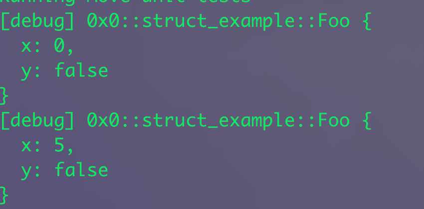

# Struct 

Structs (cấu trúc) là một trong những kiểu dữ liệu tùy chỉnh được sử dụng phổ biến nhất. Ngôn ngữ Move sử dụng structs để biểu diễn một tập hợp các dữ liệu có liên quan với nhau, tương tự như structs hoặc objects trong các ngôn ngữ lập trình khác. Bài viết này sẽ đi sâu vào cách sử dụng và các tính năng của structs trong Move. 

## Khái niệm Structs 

Trong Move, một struct được defined bằng `struct` được đứng trước bởi `public`. Cấu trúc của Struct bao gồm struct name và các fields trong đó. Mỗi field sẽ đi kèm với tên và data type của nó, được phân cách bởi dấu phẩy. Dưới đây là syntax và ví dụ: 

```rust
// syntax
public struct StructName {
    field_name: field_type,*
}

// Ví dụ:
public struct StudentBootcamp {
    id: u32,
    name: String,
    point: u8,
}
```


> Nếu bạn thắc mắc tại sao tất cả struct đều được khai báo có public. Nghĩa là vì type của struct có thể được ref từ module khác. Tuy nhiên, các trường trong struct đó và các ability để tạo create/destroy struct vẫn là trong internal của module đã defined nó. Trong tương lai khi khai báo struct có thể sẽ có `public(package)` giống với [functions](./function)


Tuy nhiên bạn cần lưu ý là những khai báo sau sẽ là lỗi: 

```rust
public struct Foo { x: Foo }
//                     ^ ERROR! recursive definition

public struct A { b: B }
public struct B { a: A }
//                   ^ ERROR! recursive definition

```

Đó là bởi vì không hỗ trợ `recursive structs`, nghĩa là struct sẽ không thể chứa bản thân nó được.


## cách để tạo và sử dụng Struct

Sau khi đã tạo một struct thì bạn có thể tạo ra những instances cho struct type đó. 


```rust 
public struct StudentBootcamp {
    id: u32,
    name: String,
    point: u8,
}

let stu_1 = Student {
    id: 1u16,
    name: string::utf8(b"Hien"),
    score: 99u8,
};


let stu_2 = Student {
    id: 2u16,
    name: string::utf8(b"qui"),
    score: 99u8,
};
```

Để access vào giá trị trong struct, sử dụng `.`. Ví dụ: 

```rust 
let name = stu_2.name; 
```


> Vậy làm thế nào để phân rã và hủy structs trong Move?

Ta có thể gán trong các mẫu sử dụng cú pháp tương tự như khi khởi tạo structs hoặc binding. Ví dụ: 


```rust 
let x: u64;
let y: bool;
let foo = Foo { x: 0, y: false };
let Foo { x, y: _ } = foo; 

// hoac la 
let Foo { x, y } = &foo;
```

## Naming structs ( Đặt tên cho Struct )

Struct có thể bắt đầu bằng các chữ cái in hoa từ `A` tới `Z`. Sau từ đầu tiên thì tên struct có thể bao gồm dấu gạch ngang `_`, từ `a` tới `z`, và số `0` đến `9`: 


```rust 
public struct NFTCollection {}
public struct MarketPlace {}
public struct Game_Token_V1 {}
public struct Defi_Pool_123 {}
public struct Coin_Market_Data {}
```

## Mượn(borrowing) struct và các trường 

Toán tử & và &mut có thể được sử dụng để tạo tham chiếu đến các struct hoặc fields. Các ví dụ như: 


```rust
let foo = Foo { x: 3, y: true };

let foo_ref: &Foo = &foo;

let y: bool = foo_ref.y;
debug::print(&y);

let x_ref: u64 = foo.x; 
debug::print(&x_ref);
```

* Ta có thể mượn  các trường bên trong của các struct lồng nhau( nested structs):

```rust
let foo = Foo { x: 3, y: true };
let bar = Bar(foo);

let x_ref = &bar.0.x;
// x_ref = 3 

```

* Bạn cũng có thể mượn một trường đã qua tham chiếu(reference) đến một struct:

```rust

 public struct Foo has drop { x: u64, y: bool }

    #[test]
    fun example() {
        let mut foo = Foo { x: 0, y: false };
        
        debug::print(&foo);
       
        
        let foo_ref = &foo;
        let x_ref = foo_ref.x;

        // chỉnh sửa lại biến 
        let x_ref_mut = &mut foo.x;
        *x_ref_mut = 5;

        debug::print(&foo);

    }

```


