# Move on basics


## Variables / Constants / Scope
Trước khi nói về các kiểu dữ liệu, hãy xem cách để khai báo và đặt tên biến trong Sui Move 

Trong Sui move, ta dùng `let` để khai báo và khởi tạo các biến (varibales). Sau khi khai báo biến, bạn có thể dễ dàng access và chỉnh sửa lại. Có nhiều kiểu để khai báo và khởi tạo biến: 

```rust
let <Variable> : <Type> 
let <Variable> = <Expression> 
let <variable> : <Type> = <Expression> 
``` 

Đây là ví dụ: 


```rust
let hello;
let hello_world : u8;
let hello_sui_bootcamp = True;
let hello_everyone : u8 = 20;

```

Tuy nhiên ngoài từ khoá `let` cho các giá trị immutable thì ta còn có `let mut` cho việc thay đổi dữ liệu 

Ngoài ra, ta còn có từ hằng số (`const`) được dùng để tạo ra các giá trị không thể thay thế. Gọi là hằng số. Đây là ví dụ khi khởi tạo hằng số: 

```rust
const <Variable> : <Type> = <Expression>
```

Hằng số (Constants) có thể được định nghĩa bằng bất kỳ kiểu dữ liệu nào. Dưới đây là một số điểm quan trọng cần biết về hằng số:
* Không thể thay đổi giá trị sau khi đã được định nghĩa
* Hằng số không thể truy cập từ bên ngoài module của nó.

```rust 

module sui_bootcamp::constants {
		
	const MAX : u64 = 100;

	public fun is_max(num: u64): bool {
		num == MAX
	}

}
```


> Tuy nhiên bạn có thể sử dụng `Config Pattern` để set up một module để khai báo hằng số cho tất cả các modules khác sử dụng: 

```rust
module sui_bootcamp::game_config {
    const PLAYER_MAX_HEALTH: u64 = 1000;
    const PLAYER_START_COINS: u64 = 50;
    const WEAPON_DAMAGE: u64 = 25;

    public fun max_health(): u64 { PLAYER_MAX_HEALTH }
    public fun start_coins(): u64 { PLAYER_START_COINS }
    public fun weapon_damage(): u64 { WEAPON_DAMAGE }
}


```

Bất kì một biến được khai báo bằng `let` đều có thể được sử dụng trong các biểu thức trong cùng một phạm vi . Phạm vi được xác định bằng các khối biểu thức ( expression blockchain) được đánh dấu bằng cặp dấu ngoặc nhọn `{...}`.

Hiểu đơn giản là các biến local sẽ không thể sử dụng ở ngoài cái scope đó được. Đây là ví dụ:

```rust
let x = 0;
{
    let y = 1;
};
x + y // ERROR!
```

Tuy nhiên, các biến cục bộ từ phạm vi bên ngoài có thể được sử dụng trong một phạm vi lồng nhau:

```rust
{
    let x = 0;
    {
        let y = x + 1; // valid
    }
}
```


# Các kiểu dữ liệu (data types) Primitive

Move có nhiều kiểu dữ liệu primitive. Bao gồm Booleans, Unsigned integers và address. 


## Unsigned integer types
Move hỗ trợ sáu kiểu số nguyên không dấu (u8, u16, u32, u64, u128, u256). Các kiểu này có giá trị từ 0 đến giá trị tối đa tương ứng, phụ thuộc vào kích thước của kiểu. Khác với Rust, Move không có số âm hoặc số thập phân.


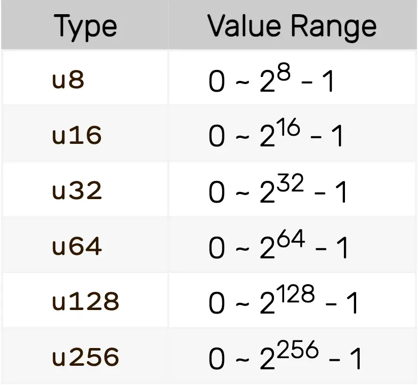


Các số có thể được biểu diễn dưới dạng thập phân hoặc thập lục phân(Hex):
```
// Decimal representation
let x: u8 = 10;

// Hexadecimal representation
let y: u8 = 0xa;

```


Nếu như kiểu dữ liệu không được xác định rõ. Thì compiler sẽ tự động xác định dựa trên ngữ cảnh. Nếu như kiểu vẫn không thể xác định được thì mặc định là `u64`. Nếu một giá trị số quá lớn so với phạm vi kích thước đã được chỉ định sẽ thông báo lỗi. 

### Các phép tính trong Move

Đối với các phép toán số học (cộng, trừ, nhân, chia, chia lấy dư) trên các kiểu dữ liệu này này, hai toán hạng phải cùng kiểu. Nếu bạn cần thực hiện phép toán trên các giá trị có kiểu khác nhau, bạn phải thực hiện **ép kiểu tường minh** (exclicit casting) trước. Lưu ý tất cả các phép toán số học sẽ dừng khi xảy ra tràn số hoặc chia cho không điều này để ngăn chặn các kiểu tấn công tràn số và tăng cường bảo mật cho chương trình.

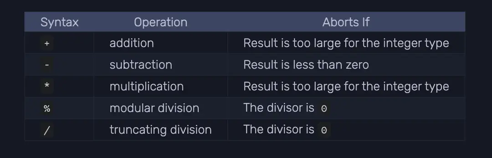


### Cách để ép kiểu trong Move( casting)

Trong Move, sử dụng `as` cho việc ép kiểu dữ liệu, cho phép một số nguyên có kích thước này được chuyển đổi thành số nguyên có kích thước khác. Nếu kết quả quá lớn so với kiểu được chỉ định, việc ép kiểu sẽ bị dừng lại (ví dụ: ép kiểu một giá trị u16 thành u8 có thể gây tràn số).


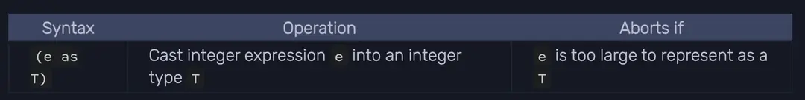

Kiểu dữ liệu Integers là kiểu duy nhất trong Move hỗ trợ cho việc ép kiểu(casting). Ví dụ dưới đây ta có thể đổi y sang u64 cho phép tính toán với giá trị z: 

```rust 

public fun casting_function() {
    let x: u8 = 94; 

    // 
    let y: u64 = x as u64;

    let _z = 98u64 + y; 

}

```

Đây là một số ví dụ khác về việc casting: 

```rust
(x as u8)
(y as u16)
(87316 as u32)
(2u8 as u64)
(1 + 3 as u128)
(4/2 + 12345 as u256)
```


## Boolean 

Trong Sui move, Boolean hoạt động giống với các ngôn ngữ khác đều có 2 giá trị là true và false. Kiểu boolean thường được dùng cho các phần điều kiện ( control program flow). Ví dụ cho kiểu dữ liệu boolean: 

```rust 
let x: bool = true; 
let mut y: bool = false; 
```

Kiểu Boolean hỗ trợ cho các toán tử logic: 

* Toán tử && (`AND`),`p && q` sẽ tương đương với `if(p) q else false`, nghĩa là nó chỉ true khi cả 2 đều true
* Toán tử || (`OR`), `p || q` sẽ tương đương với `if(p) true else q`, nghĩa là một trong hai đó là true thì sẽ true.
* Toán tử ! (`NOT`), `!p` sẽ tương đương với `if (p) false else true`, nghĩa là phủ định


import React, { useState } from 'react';

export const LogicalOperatorQuiz = () => {
  const [selected, setSelected] = useState(null);
  const [isCorrect, setIsCorrect] = useState(false);

  const handleSelect = (operator) => {
    setSelected(operator);
    setIsCorrect(operator === '&&');
  };

  return (
    <div className="p-4 bg-white dark:bg-gray-800 shadow-md rounded-md">
      <p className="text-lg font-semibold mb-4 text-black dark:text-white">
        Trong logic lập trình, nếu tất cả các điều kiện đều phải được thỏa mãn thì nên sử dụng toán tử logic nào?
      </p>
      <div className="flex space-x-4">
        <button
          onClick={() => handleSelect('&&')}
          className={`px-4 bg-white py-2 rounded-md transition-colors duration-200 text-white ${
            selected === '&&' ? 'bg-gray-300 dark:bg-gray-600' : 'bg-gray-100 hover:bg-gray-200 dark:bg-gray-700 dark:hover:bg-gray-600'
          }`}
        >
          &&
        </button>
        <button
          onClick={() => handleSelect('||')}
          className={`px-4 py-2 rounded-md transition-colors duration-200 text-white ${
            selected === '||' ? 'bg-gray-300 dark:bg-gray-600' : 'bg-gray-100 hover:bg-gray-200 dark:bg-gray-700 dark:hover:bg-gray-600'
          }`}
        >
          ||
        </button>
        <button
          onClick={() => handleSelect('!!')}
          className={`px-4 py-2 rounded-md transition-colors duration-200 text-white ${
            selected === '!!' ? 'bg-gray-300 dark:bg-gray-600' : 'bg-gray-100 hover:bg-gray-200 dark:bg-gray-700 dark:hover:bg-gray-600'
          }`}
        >
          !!
        </button>
      </div>
      {selected && (
        <p className={`mt-4 text-sm ${isCorrect ? 'text-green-600 dark:text-green-400' : 'text-red-600 dark:text-red-400'}`}>
          {isCorrect ? 'Correct!' : 'Try again!'}
        </p>
      )}
    </div>
  );
};

Để hiểu thêm thì bạn có thể trả lời bài quiz sau: 

<LogicalOperatorQuiz />


### What is variable shadowing?
Trước khi giải thích về shadowing. Mình có một ví dụ sau đây trong function immute_fun có một giá trị không thể thay đổi là _x:

```rust
public fun immute_fun() {
    let _x: bool = true;
    _x = false;
}

```

Khi chạy lệnh `sui move build` bạn sẽ gặp lỗi sau: 

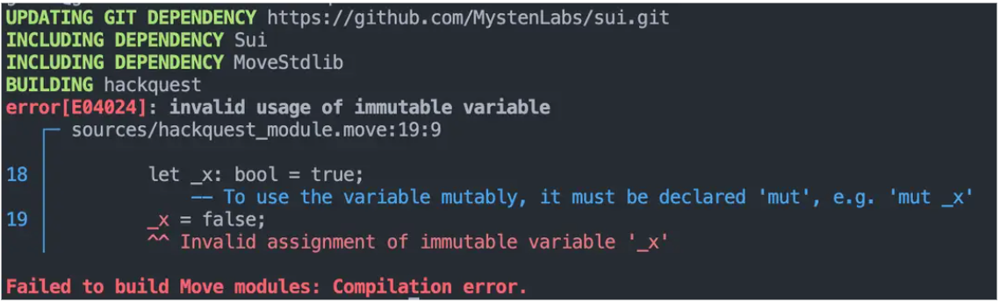

Lỗi này cho thấy bạn không thể thay đổi giá trị của _x được vì đó là giá trị immutable. Như vậy bạn cần khai báo lại giá trị thành mutable mut_X 


```rust 
public fun mute_fun(){
    let mut _x: bool = true;
    _x = false;
}

```


Variable shadowing xảy ra khi mà một biến mới trùng têm được khai báo cng tên. Tại thời điểm này, có hai biến tồn tại trong chương trình. Do đều nằm trong một phạm vi (scope) 


## Address 

Trong Move, địa chỉ (Address) là một kiểu dữ liệu cơ bản được tích hợp sẵn, dùng để biểu thị tài khoản trên blockchain. Giá trị của một address là  định danh 256-bit (32-byte), thường được biểu diễn dưới dạng chuỗi hex với tiền tố( prefix) là `0x`.

Ví dụ: 
```
0x80d6241496f68b205dee09025b156ee6f6a944d88a5238cdf05d148a05bf399a
```

Ví dụ trên là một địa chỉ hợp lệ. Nó chứa bao gồm 64 ký tự (32 bytes) và bắt đầu bằng `0x`. Kiểu dữ liệu address là một phần cần thiết ở Sui Move. Nó dùng để identify những phần sau: 
* Module packages: Mỗi module package sẽ có một địa chỉ riêng biệt, khác biệt với các modules khác
* Accounts: Tất cả tài khoản trên Sui sẽ có address để lưu trữ và quản lý tài sản 
* Objects: Trong sui move, các objects sẽ là data structure được lưu trữ trên blockchain, mỗi object đi kèm với address
* Transaction: Kể cả khi gửi hay nhận transaction đều sẽ yêu cầu target address là gì


Chi tiết về address đã được mình viết ở mục [Sui Concepts](../Basic_Concepts/sui_move_address_accounts)


Đây là một số ví dụ Address:

```rust 

// Hexadecimal address
let addr1: address = @0x1a;

// Any valid numeric value can be an address
let a2: address = @12_345;

// Named address
let addr3: address = @alice;


// Name address đã có ở Move.toml
[addresses]
alice = "0xA11CE"

```

export const CodeTabs = () => {
  const [activeTab, setActiveTab] = useState('move');

  return (
    <div className="p-6 bg-white dark:bg-gray-900 shadow-lg rounded-lg">
      <div className="flex space-x-2 mb-4">
        <button
          onClick={() => setActiveTab('move')}
          className={`px-4 py-2 rounded-lg font-medium transition-colors duration-300 ${
            activeTab === 'move' ? 'bg-blue-500 text-white' : 'bg-gray-200 text-gray-700 hover:bg-gray-300'
          }`}
        >
          sui_bootcamp.move
        </button>
        <button
          onClick={() => setActiveTab('toml')}
          className={`px-4 py-2 rounded-lg font-medium transition-colors duration-300 ${
            activeTab === 'toml' ? 'bg-blue-500 text-white' : 'bg-gray-200 text-gray-700 hover:bg-gray-300'
          }`}
        >
          Move.toml
        </button>
      </div>

      {activeTab === 'move' && (
        <div className="mt-4">
          <pre className="bg-gray-100 dark:bg-gray-800 p-4 rounded-lg overflow-x-auto">
            <code className="language-rust text-sm text-gray-800 dark:text-gray-200">
              {`module sui_bootcamp::module_modules {
  use sui::address;
  use std::debug;
  use std::string::String;

  #[test]
  public fun address_function_2() {
    // Convert address to u256 type
    let addr_as_u256: u256 = address::to_u256(@0x1);
    // print: 1
    debug::print(&addr_as_u256);

    // Convert u256 to address type
    let addr = address::from_u256(addr_as_u256);
    // print: 0x1
    debug::print(&addr);

    // Convert address to vector
    let addr_vec = address::to_bytes(addr);
    // print: [1]
    debug::print(&addr_vec);
    
    // Convert vector<u8> to address type
    let addr = address::from_bytes(addr_vec);
    // print: @0x1
    debug::print(&addr);
		
    // Convert address to string
    let addr_as_string: String = address::to_string(@0x1);
    // print: "0000000000000000000000000000000000000000000000000000000000000001"
    debug::print(&addr_as_string);
  }
}`}
            </code>
          </pre>
        </div>
      )}

      {activeTab === 'toml' && (
        <div className="mt-4">
          <pre className="bg-gray-100 dark:bg-gray-800 p-4 rounded-lg overflow-x-auto">
            <code className="language-toml text-sm text-gray-800 dark:text-gray-200">
              {`# Example Move.toml content
[package]
name = "sui_bootcamp"
version = "0.0.1"

[addresses]
sui_bootcamp = "0x1"`}
            </code>
          </pre>
        </div>
      )}
    </div>
  );
};


Sui framework cung cấp nhiều helper functions để xử lý address. Bởi vì kiểu dữ liệu address là 32-byte. Nó cần convert sang u256. Address cũng có thể convert sang vector để lưu trữ:

<CodeTabs />


Đây là kết quả sau khi chạy lệnh `sui move test`

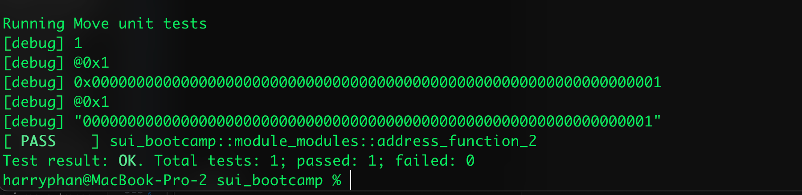


## Vector type 

Vector là data structure hoạt động giống mảng trong Sui Move. Để sử dụng vector, bạn cần import thư viện `std::vector` và dùng `let` để khai báo. Cấu trúc của vector là `vector<T>`. Trong đó T là kiểu dữ liệu của các phần tử trong vector, nó là generic type. 

Vector trong Sui move khá tương đồng với `Vec` trong Rust và `ArrayList` trong java. Trong Vector module sẽ có nhiều functions giúp create, access và tính toán vector. Các native functions đó được viết bằng rust và được gọi thông qua Sui Move VM.

Đây là ví dụ: 
```rust 

module sui_bootcamp_examples::vector_examples {
    use std::vector;

    let v = vector::empty<u8>();
}
```


Để tạo vector có 2 cách chính: 


1. Tạo vector với giá trị khởi tạo: 
```
let v = vector[1, 2, 3, 4, 5];
```


2. Tạo vector rỗng: `vector::empty<T>()`:
```
let v = vector::empty<u64>();
```

Note: `<u64>` không bắc buộc phải có nếu như đã có các phần tử add vào trong vector này: 


```rust 
let v = vector::empty();

v::push_back(&mut v, 5);
v::push_back(&mut v, 6);
v::push_back(&mut v, 6);
```

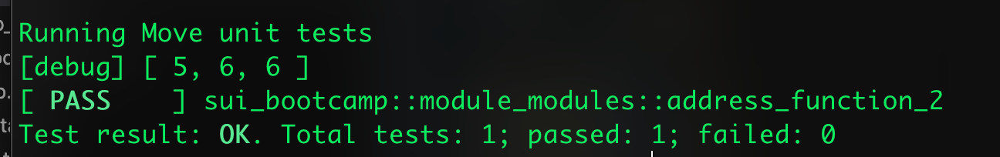

Để đọc value từ vector, dùng `borrow` function: 

```rust 

let v = vector[1,2,3,4];
let x = vector::borrow(&v, 2);
debug::print(&x)
```

Nếu bạn chạy hàm trên bạn sẽ gặp lỗi:

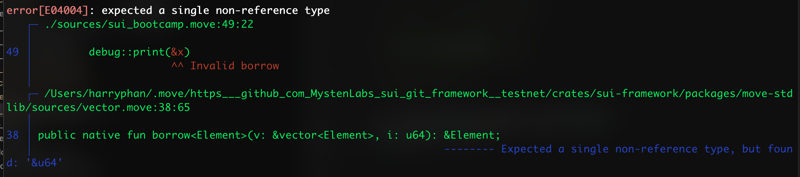

Là bởi vì x đang là reference type nghĩa là sẽ không thể bị thay đổi trực tiếp được. Bạn có thể tạo một bản sao bằng cách:

```rust
let v = vector[1,2,3,4];
let x = *vector::borrow(&v, 2);
debug::print(&x)
```


Để chỉnh sửa giá trị của vector, ta có thể sử dụng `borrow_mut` function:
```rust 
  let mut v = vector[1,2,3,4];
  
  let x = vector::borrow_mut(&mut v, 2);
  *x = *x + 1;
  debug::print(x)
```

Kết quả: 
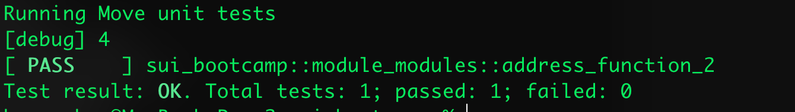

Để xoá phần tử trong vector, ta có thể sử dụng `vector::pop_back` function: 

```rust 
  let mut v = vector[1,2,3,4];
  let x = vector::pop_back(&mut v);
  debug::print(&x);
  debug::print(&v);
```

Kết quả: 
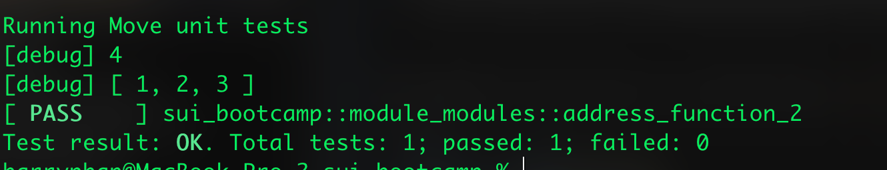


Bạn cũng có thể xóa một phần tử cụ thể từ vector bằng cách sử dụng các hàm `index_of` và `swap_remove`:

```rust 
let number = 3;
let mut v = vector[1, 2, 3, 4];

let (found, index) = vector::index_of(&v, &number);
debug::print(&found);
debug::print(&index);

if(found) {
    vector::swap_remove(&mut v, index);
};

debug::print(&v);
```

Kết quả: 

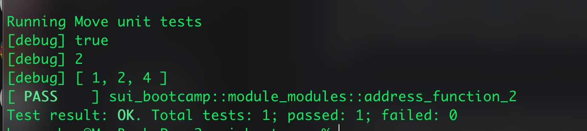

 
Bạn cũng có thể đảo ngược vector bằng cách sử dụng `vector::reverse` và gộp mảng với `vector::append`:

```rust 
let mut v1 = vector[1,2,3,4];
let v2 = vector[5,6,7,8];

vector::reverse(&mut v1);
vector::append(&mut v1, v2);

debug::print(&v1);  
```


Vector trong Vector (Nested Vector)

```rust
// Define a vector of vector<u8>
let vv: vector<vector<u8>> = vector[vector[10, 20], vector[30, 40]];
```

> Note: Mặc dù `Vector` có thể được lưu trữ bất kì dữ liệu nhưng nó chỉ chứa các giá trị có kiểu dữ liệu giống nhau. Ví dụ với `vector<u8>` thì nó chỉ chứa các giá trị kiểu u8. Và `vector<bool>` chứa các phần tử kiểu bool.  

Các hàm trong Vector module

Thử viện tiêu chuẩn của Move cung cấp nhiều hàm có thể sử dụng với vector.

```rust 

1. vector::push_back<T>(v: &mut vector<T>, t: T): Thêm phần tử vào cuối Vector
2. vector::pop_back<T>(v: &mut vector<T>): T: xoá phần tử cuối từ Vector
3. vector::length<T>(v: &vector<T>): u64: Trả về độ dài vector
4. vector::is_empty<Element>(v: &vector<T>): bool: Kiểm tra vector có rỗng hay không
5. vector::remove<T>(v: &mut vector<T>, i: u64): T: Xoá phần tử tại vị trí i
6. vector::singleton<T>(e: T): vector<T>: Tạo vector có size 1 với phần tử T
7. vector::contains<T>(v: &vector<T>, e: &T): bool: Kiểm tra vector có chứa phần tử e hay không

```

Đọc chi tiết ở đây: [Vector module](https://move-book.com/reference/primitive-types/vector.html)

## Strings
Ngôn ngữ Move không hỗ trợ trực tiếp `String` nhưng ta có thể sử dụng `String` module trong thư viện để xử lý string data. Trong thư viện có `std::string` và `std::ascii` modules để định nghĩa các loại string cung cấp các methods cho việc tạo, chỉnh sửa và xử lý string. 

Để sử dụng kiểu dữ liệu `String`, bạn cần import nó từ module: `std::string`


```rust
use std::string::{Self, String};

let hello = string::utf8(b"Hello, world!");
```

Cách để tạo string bằng việc chuyển đổi từ ASCII strings bằng cách dùng `from_ascii` function: 

```rust
let ascii_string = string::from_ascii(b"Hello, world!");
let utf8_string = string::from_ascii(ascii_string);

```

Move hỗ trợ các functions cho string: 
* `append`: Nối 2 chuỗi 
* `append_utf8`: Nối chuỗi UTF-8
* `insert`: Chèn chuỗi vào vị trí i 
* `sub_string`: Trả về chuỗi con từ vị trí i đến j
* `index_of`: Trả về vị trí của phần tử e trong chuỗi
* `utf8`: Chuyển đổi chuỗi sang UTF-8
* `is_empty`: Kiểm tra chuỗi có rỗng hay không
* `length`: Trả về độ dài chuỗi


Bất kể loại chuỗi nào được sử dụng, cách thức hoạt động bên trong của chúng đều dựa trên mảng byte (`vector<u8>`). Lấy ví dụ:

```rust
module std::ascii {
    use std::option::{Self, Option};

    /// This struct stores the underlying byte array
    public struct String has copy, drop, store {
        bytes: vector<u8>,
    }

    /// Converts an ASCII byte array to a string
    public fun string(bytes: vector<u8>): String {
       let x = try_string(bytes);
       assert!(x.is_some(), EINVALID_ASCII_CHARACTER);
       x.destroy_some()
    }

    /// Validates each byte to ensure it is a valid ASCII character
    public fun try_string(bytes: vector<u8>): Option<String> {
        let len = bytes.length();
        let mut i = 0;
        while (i < len) {
            let possible_byte = bytes[i];
            if (!is_valid_char(possible_byte)) return option::none();
            i = i + 1;
        };
        option::some(String { bytes })
    }

    /// The valid ASCII range here is 0-122
    public fun is_valid_char(b: u8): bool {
       b <= 0x7F
    }

```

Nó sử dụng struct `String` để lưu trữ chuỗi, về bản chất vẫn là một mảng byte kiểu u8. Khi gọi hàm `ascii::string` để chuyển đổi mảng byte thành chuỗi, hệ thống sẽ thực thi hàm `try_string` để xác thực từng byte, đảm bảo đó là ký tự ASCII hợp lệ. 


Giới hạn này chỉ cho phép 122 ký tự có thể in được đầu tiên. Sau khi xác thực thành công, hệ thống trả về `option::some` và giải nén chuỗi thông qua hàm option::destroy_some. Trong trường hợp thất bại, nó sẽ hủy thực thi và trả về option::none().


Đây là code example. Bạn có thể chạy lệnh `sui move test`: 

```rust

module sui_data_types::string {
    use std::string;
    use std::debug;

    #[test]
    fun test_string_works() {
        // create a string from 'utf-8' bytes
        let s1 = string::utf8(b"hello");
        debug::print(&s1);
        assert!(s1 == string::utf8(b"hello"), 0);

        // append a 'utf-8' to s1
        string::append_utf8(&mut s1, b" world");
        assert!(s1 == string::utf8(b"hello world"), 1);

        // get the substring of a string
        let s1_sub = string::sub_string(&s1, 0, 5);     // [0, 5) i.e. 0, 1, 2, 3, 4
        debug::print(&s1_sub);  // "hello"

        // join 2 strings
        let s1 = string::utf8(b"hello");
        let s2 = string::utf8(b" abhi");
        string::append(&mut s1, s2);
        assert!(s1 == string::utf8(b"hello abhi"), 2);

        // check if empty
        assert!(!string::is_empty(&s1), 3);

        // get the bytes of a string
        let b1 = string::bytes(&s1);
        debug::print(b1);       // print the bytes of "hello abhi"
}
}
```


## Option Type 
Option là một kiểu dữ liệu dùng để represent một cái giá trị có thể hoặc không cần tồn tại. Khái niệm từ Option mượn từ ngôn ngữ rust. Bạn có thể học qua khoá học rust bootcamp để hiểu về type này nha. 

Option là một cách đơn giản để xử lý dữ liệu khi không chắc chắn một giá trị có tồn tại hay không. Điều này giúp tránh được các lỗi phổ biến trong lập trình. Option luôn an toàn để sử dụng vì nó được thiết kế để xử lý cả trường hợp có dữ liệu và không có dữ liệu. Ưu điểm của cách này là làm cho code rõ ràng hơn, vì lập trình viên có thể dễ dàng biết được đâu là những giá trị có thể không tồn tại.  Option là generic type được định nghĩa trong thư viện tiêu chuẩn của move dưới `std::option` . Module cung cấp nhiều function bao gồm tạo `Some` và `None` instances, kiểm tra states..

```rust
// Return an `Option` containing `e`
public fun some<Element>(e: Element): Option<Element> {
    Option { vec: vector::singleton(e) }
}

public fun none<Element>(): Option<Element> {
    Option { vec: vector::empty() }
}
```

Đây là ví dụ cách tạo Option instances: 
```rust
let some_value: Option<vector<u8>> = option::some(b"Alice");
let none_value: Option<vector<u8>> = option::none();

```


### Option có nhiều methods:

Để sử dụng kiểu `Option` , bạn cần import module `std::option` và sử dụng kiểu `Option`. Sau đó bạn có thể tạo một giá trị `Option` bằng cách sử dụng các phương thức `some` hoặc `none`.

* `is_none` trả về true nếu option là None

```
let absent = option::none();
assert!(option::is_none(&absent), 0);
```

* `is_some`: trả về true nếu option là Some

```rust 
let some_value = option::some(42);
assert!(option::is_some(&some_value), 0);
```


* `contains` trả về true nếu Option chứa giá trị cụ thể.

```rust 
let some_value = option::some(42);
assert!(option::contains(&some_value, &42), 0);
```

* Một giá trị có thể đọc từ Option:

```rust
let some_value = option::some(12);
let value = option::borrow(&some_value);


//  value có thể đọc với giá trị ở trong Option, nếu giá trị trong Option không có thì sẽ lấy giá trị ở tham số bên cạnh  là 42
let value_default = option::borrow_with_default(&some_value, &42);
debug::print(value_default);

```


* Một tham chiếu có thể thay đổi (mutable reference) tới giá trị có thể được lấy ra từ Option và được sử dụng để chỉnh sửa giá trị đó:

```rust 
let mut some_value = option::some(42);
let value = option::borrow_mut(&mut some_value);
*value = 45;

debug::print(value)
```


* Giá trị bên trong một Option có thể được thay thế bằng một giá trị mới:

```rust 
let mut _value = option::some(40);
let old_value = option::swap(&mut _value, 45);

debug::print(&_value);
debug::print(&old_value);
```

* Các giá trị cũng có thể được điền vào hoặc trích xuất từ một Option:
```rust
let mut  absent = option::none();
debug::print(&absent);

option::fill(&mut absent, 42);
debug::print(&absent);

let value = option::extract(&mut absent);
debug::print(&value);
debug::print(&absent);

```

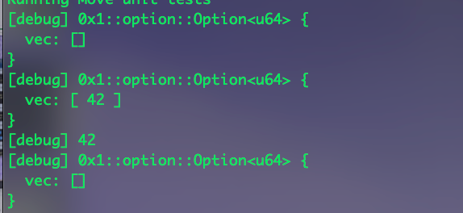


 