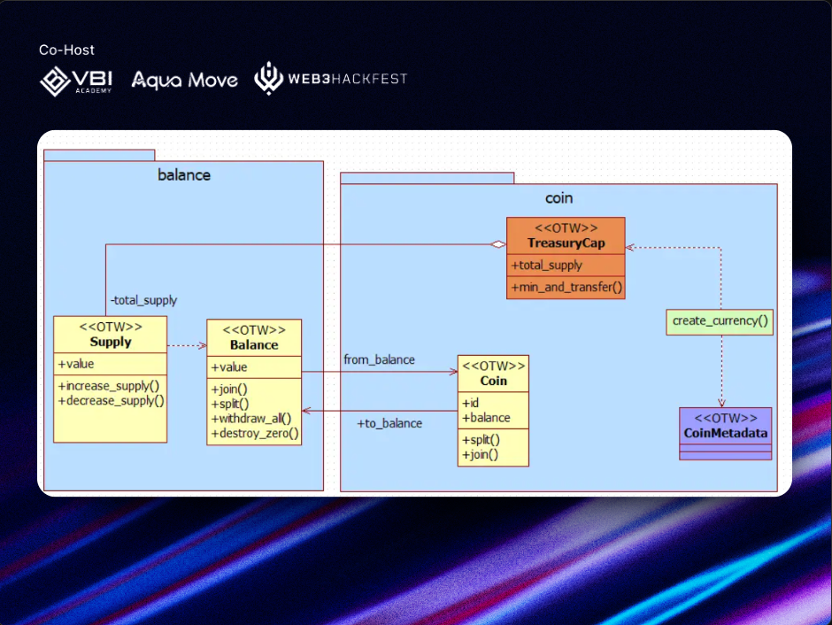
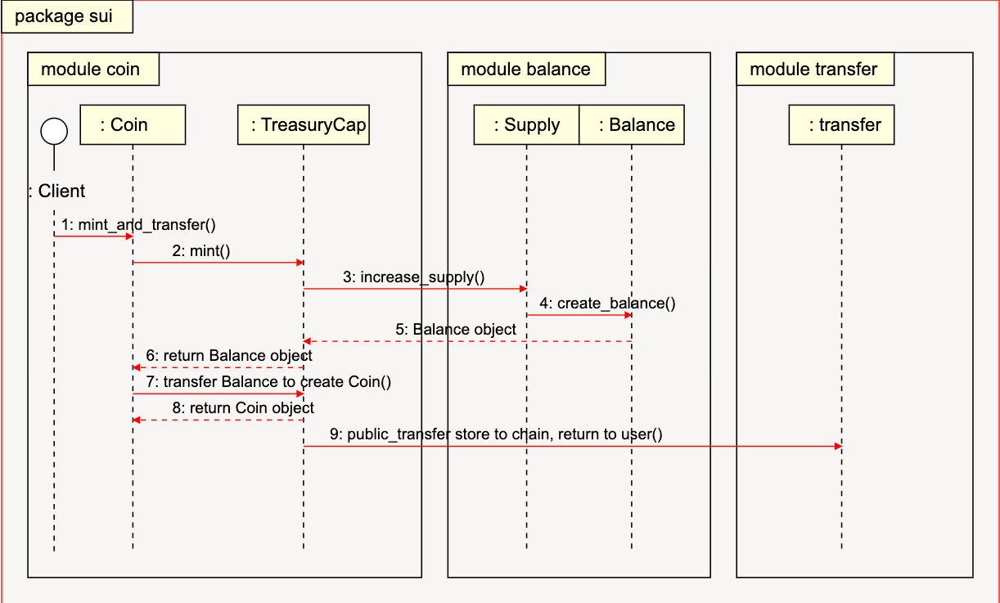

# Balance module 

Module Balance của Sui là một thành phần quan trọng để quản lý số dư và nguồn cung. Module này không chỉ được dùng trong module Coin để thực hiện các thao tác supply cơ bản, mà còn có thể tạo các token tùy chỉnh. 

Bài học sẽ phân tích chi tiết về cấu trúc, các hàm và cách sử dụng module Balance, giúp bạn hiểu rõ và tận dụng hiệu quả module này.





## Thế nào là Balance module?


Module Balance định nghĩa các struct chính sau:

**`Supply` Struct**: Đây là struct đại diện cho nguồn cung của một token type cụ thể, thường được dùng để **mint** và **burn token**. Nó được đóng gói trong TreasuryCap của module Coin để kiểm soát quyền hạn, đảm bảo chỉ những tài khoản được ủy quyền mới có thể thay đổi nguồn cung token.

```rust
public struct Supply<phantom T> has store {
    value: u64
}
```

`Balance` Struct: Đây là struct đại diện cho số dư của một loại token cụ thể. Nó thường được sử dụng như field balance trong module Coin, biểu diễn thông tin số dư của Coin đó. Tài sản của người dùng được tạo thành từ các đối tượng Coin riêng lẻ chứa balance.

```rust
public struct Balance<phantom T> has store {
    value: u64
}
```

## Các function chính khi bạn làm việc với Sui Balance




Module Balance cung cấp một số hàm  để quản lý số dư và nguồn cung. Sau đây là giới thiệu chi tiết về một số hàm quan trọng:

### **Hàm `value`**: 

Hàm **`value`** dùng để đọc số dư hiện tại của một Balance. Nó lấy giá trị số dư và trả về u64. Bạn có thể dùng hàm này để xem số dư trong ví của mình.

```rust
public fun value<T>(self: &Balance<T>): u64 {
    self.value
}
```

### Hàm `supply_value`: 

Dùng để lấy giá trị của một Supply cụ thể, thường được dùng khi  cần biết tổng cung của một loại token, ví dụ như kiểm tra số lượng token đã phát hành.

```rust
public fun supply_value<T>(supply: &Supply<T>): u64 {
    supply.value
}
```

### `create_supply`: 

Tạo một Supply mới với giá trị ban đầu là 0. Hàm này thường được sử dụng khi bạn muốn tạo một loại token mới và khởi tạo nguồn cung cho nó.


```rust
public fun create_supply<T: drop>(_: T): Supply<T> {
    Supply { value: 0 }
}
```

### **Hàm increase_supply**: 

Tăng nguồn supply và tạo một Balance mới. Hàm này trước tiên kiểm tra xem việc tăng có gây tràn số( overflow) hay không, sau đó tăng giá trị của Supply theo số lượng được chỉ định và trả về một struct Balance mới với số lượng đã tăng.

Hàm này thường được sử dụng khi mint token mới, ví dụ như phát hành thêm token để tăng nguồn cung trên thị trường.

```rust
public fun increase_supply<T>(self: &mut Supply<T>, value: u64): Balance<T> {
    assert!(value < (18446744073709551615u64 - self.value), EOverflow);
    self.value = self.value + value;
    Balance { value }
}
```

### Hàm decrease_supply: 

Ngược lại với hàm increase_supply, hàm này dùng để hủy một Balance và giảm nguồn cung. Hàm sẽ lấy giá trị của Balance, kiểm tra xem Supply hiện tại có lớn hơn hoặc bằng số lượng cần giảm không, sau đó giảm giá trị của Supply và trả về số lượng đã giảm. Hàm này thường được sử dụng khi burn token.

```rust
public fun decrease_supply<T>(self: &mut Supply<T>, balance: Balance<T>): u64 {
    let Balance { value } = balance;
    assert!(self.value >= value, EOverflow);
    self.value = self.value - value;
    value
}
```

### Hàm join: 

Merge hai Balance thành một. Hàm này cộng giá trị của Balance được truyền vào với Balance hiện tại và trả về tổng giá trị. . Nó giống với  hàm join trong module Coin. Cách thức hoạt động bên trong của nó chính là gọi hàm join của module Balance.

```rust
public fun join<T>(self: &mut Balance<T>, balance: Balance<T>): u64 {
    let Balance { value } = balance;
    self.value = self.value + value;
    self.value
}
```

Đây là ví dụ: 

```
module sui_bootcamp::balance_module {
    use sui::balance;
    use sui::sui::SUI;

    #[test]
    fun test_balance() {
        let mut balance = balance::zero<SUI>();
        let another = balance::create_for_testing(1000);

				// balance join
        balance.join(another);
        assert!(balance.value() == 1000);

				// Balance split
        let balance1 = balance.split(333);
        let balance2 = balance.split(333);
        let balance3 = balance.split(334);

        balance.destroy_zero();

        assert!(balance1.value() == 333);
        assert!(balance2.value() == 333);
        assert!(balance3.value() == 334);

        test_utils::destroy(balance1);
        test_utils::destroy(balance2);
        test_utils::destroy(balance3);
    }
}

```
