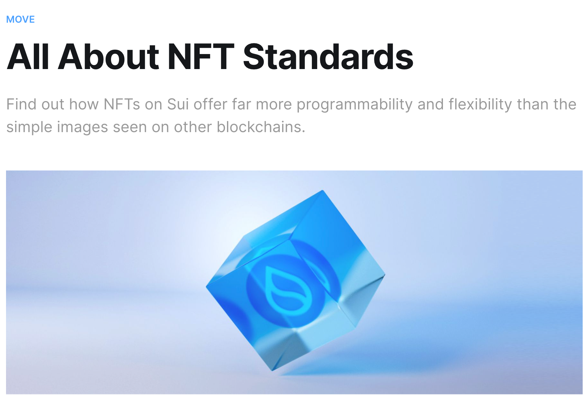

# NFT là gì? 

NFT là những mã số đặc biệt trên nền tảng blockchain - cùng công nghệ với Bitcoin và Ethereum. Điều đặc biệt là mỗi NFT là duy nhất và không thể sao chép. Một NFT có thể đại diện cho nhiều thứ như: tranh ảnh kỹ thuật số, bài hát, video, đất ảo trong game, hay thậm chí là một bài đăng trên mạng xã hội. Mỗi NFT có chữ ký số riêng để chứng minh quyền sở hữu và nguồn gốc của nó.

NFT mang đến cơ hội mới cho nghệ sĩ và người sáng tạo, giúp họ bán tác phẩm số của mình dễ dàng hơn. NFT cũng tạo ra nhiều cuộc thảo luận về mối quan hệ giữa công nghệ và nghệ thuật số. Khi NFT ngày càng phát triển và được sử dụng rộng rãi hơn, nó cho thấy tiềm năng lớn của công nghệ blockchain không chỉ giới hạn ở tiền điện tử.



> NFTs on Sui are objects, and can be programmed in the same way as any other object

Hiểu đơn giản NFT chính là các objects mà trong các bài học các bạn đã tạo ra. 

## Cách implements NFT ? 

1. Creator: 
Creator là những người make NFT. Ví dụ như có thể là artist tạo ra các digital art hay nghệ sĩ làm nhạc, hay là game developer tạo ra các items.

Các creator này họ cũng cần phải mint NFT, các NFT ấy sẽ có các owner đi kèm metadata.

2. NFT tokens 
Số lượng NFT đó mà. 


3. Collections 

Giả sử bây giờ có nhiều NFT chung theme thì gọi là gì? đó là bộ sưu tập NFT ( NFT collection). Các NFT này có thể có chung một chủ đề, phong cách hoặc người tạo ra nó.
Trong các nội dung sau mình sẽ hướng dẫn mọi người cách có thể tạo một collection cho riêng mình. 


## Create a simple NFT 

Các steps mà bạn sẽ cần tạo NFT: 
* Tạo NFT module do bạn đặt tên. Ví dụ: `testnet_nft`:

```rust
module sui_bootcamp::testnet_nft {
    use sui::url::{Self, Url};
    use std::string;
    use sui::object::{Self, ID, UID};
    use sui::event;
    use sui::transfer;
    use sui::tx_context::{Self, TxContext};
}
```

* Cách tạo một struct `testnet_nft` với các fields id,name...

```
public struct Testnet_nft has key, store {
    id: UID,
    name: string::String,
    description: string::String,
    url: Url,
}
```

* Nhớ là viết mint function với các thông tin như `name`, `description`, `url`..  để tạo ra NFT và transfer NFT đó đến người kí transaction đó

```rust

public entry fun mint(
    name: vector<u8>,
    description: vector<u8>,
    url: vector<u8>,
    ctx: &mut TxContext
) {
   

    let nft = Testnet_nft {
        id: object::new(ctx),
        name: string::utf8(name),
        description: description.to_string(),
        url: url::new_unsafe_from_bytes(url)
    };

    transfer::public_transfer(nft, ctx.sender());
}

```

# Summary lại là: 

## **NFT**
- NFT sẽ có unique code 
- Có Ownership( Người sẽ sỡ hữu NFT đó) 
- Chứa các attributes( Name, ImageURL) 

Bất kỳ Object nào implement Display đều là một NFT. Standard Display của object Sui là một template engine cho phép quản lý on-chain các biểu diễn off-chain (display) của các type( Các bạn sẽ được học ở nội dung tiếp theo)

