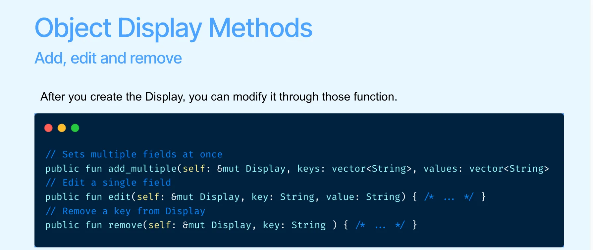

Trong lập trình Sui Move, module `Display` định nghĩa một format hiển thị để cung cấp cách thức linh hoạt và có thể mở rộng trong việc hiển thị các object.

Bằng cách lưu trữ metadata trong một object Display và liên kết nó với các loại object khasc, các developer có thể tùy chỉnh và quản lý việc hiển thị object một cách linh hoạt honw. Module này hỗ trợ sử dụng template để định nghĩa các fields sex hiển thị: 

```rust
public struct Display<phantom T: key> has key, store {
id: UID,
/// Contains fields for display. Currently supported
/// fields are: name, link, image and description.
fields: VecMap<String, String>,
// Version that can only be updated manually by the Publisher.
version: u16
}
```

Lý do bài học trước bạn học là Publisher là vì bạn cần dùng nó để tạo `display`. `Display<T>` biểu diễn  một object dùng để chỉ định một tập các template có tên cho type T. Ví dụ ta có type là `0x2:hero::Hero` thì sẽ là `Display<0x2:hero::Hero>`

Mình lấy ví dụ: 

```rust
module 0x0::game_item {
    use sui::object::{Self, UID};
    use sui::package;
    use sui::display;
    use sui::tx_context::{Self, TxContext};
    use sui::transfer;
    use std::string::{utf8, String};

    public struct GAME_ITEM has drop {}
    
    public struct GameItem has key, store {
        id: UID,
        name: String,
        power: u64,
        item_type: String,
    }

    fun init(witness: GAME_ITEM, ctx: &mut TxContext) {
        let publisher = package::claim(witness, ctx);
        
        let mut display = display::new_with_fields<GameItem>(
            &publisher,
            vector[
                utf8(b"name"),
                utf8(b"power"),
                utf8(b"type"),
                utf8(b"description"),
                utf8(b"rarity"),
                utf8(b"level"),
                utf8(b"durability"),
                utf8(b"creator"),
                utf8(b"image_url"),
                utf8(b"external_url")
            ],
            vector[
                utf8(b"{name}"),
                utf8(b"Power Level: {power}"),
                utf8(b"Type: {item_type}"),
                utf8(b"A powerful item in the game universe!"),
                utf8(b"Rarity: {rarity}"),
                utf8(b"Level {level}"),
                utf8(b"Durability: {durability}/100"),
                utf8(b"Created by: {creator}"),
                utf8(b"https://game.example.com/items/{id}/image"),
                utf8(b"https://game.example.com/items/{id}")
            ],
            ctx
        );

        display::update_version(&mut display);

        transfer::public_transfer(publisher, tx_context::sender(ctx));
        transfer::public_transfer(display, tx_context::sender(ctx));
    }

    public fun mint(
        name: String,
        power: u64,
        item_type: String,
        ctx: &mut TxContext
    ){
        transfer::transfer( GameItem {
            id: object::new(ctx),
            name,
            power,
            item_type
        }, ctx.sender() );
    }
}

```


Và đây là kết quả sau khi chạy `sui client publish`: 

```rust 
╭────────────────────────────────────────────────────────────────────────────────────────────────────────────────────────────────╮
│ Object Changes                                                                                                                 │
├────────────────────────────────────────────────────────────────────────────────────────────────────────────────────────────────┤
│ Created Objects:                                                                                                               │
│  ┌──                                                                                                                           │
│  │ ObjectID: 0x1d64fb11aebb22235f9d5674c9621225af1cdefea56ba7fec0e10fef3086811b                                                │
│  │ Sender: 0x915c2d19ee5fde257693f25e6c2cabb04c25e7ae03932817d52e122258c88ddb                                                  │
│  │ Owner: Account Address ( 0x915c2d19ee5fde257693f25e6c2cabb04c25e7ae03932817d52e122258c88ddb )                               │
│  │ ObjectType: 0x2::package::Publisher                                                                                         │
│  │ Version: 110923753                                                                                                          │
│  │ Digest: 9fvVCrpbyKC5WoCpNAL21WhMYYeE882wSBYh8uAW117G                                                                        │
│  └──                                                                                                                           │
│  ┌──                                                                                                                           │
│  │ ObjectID: 0x61cede41bc6ad771e4ecab1de1abd22776efdeaa326117a8543c95204f251d2f                                                │
│  │ Sender: 0x915c2d19ee5fde257693f25e6c2cabb04c25e7ae03932817d52e122258c88ddb                                                  │
│  │ Owner: Account Address ( 0x915c2d19ee5fde257693f25e6c2cabb04c25e7ae03932817d52e122258c88ddb )                               │
│  │ ObjectType: 0x2::package::UpgradeCap                                                                                        │
│  │ Version: 110923753                                                                                                          │
│  │ Digest: 2jdpEkRmDuSc3A32N43eo2MATe2Ggzkebin7jYfcacTN                                                                        │
│  └──                                                                                                                           │
│  ┌──                                                                                                                           │
│  │ ObjectID: 0xc0c19d1dcaf06f46d7160a9a98f2040aca44cf3389de7ec070a38ddc19b95ce7                                                │
│  │ Sender: 0x915c2d19ee5fde257693f25e6c2cabb04c25e7ae03932817d52e122258c88ddb                                                  │
│  │ Owner: Account Address ( 0x915c2d19ee5fde257693f25e6c2cabb04c25e7ae03932817d52e122258c88ddb )                               │
│  │ ObjectType: 0x2::display::Display<0x6371958d98f28b32cd46c60092218a4d4f8eaa5044df2dce4310ec452b653a51::game_item::GameItem>  │
│  │ Version: 110923753                                                                                                          │
│  │ Digest: 2WWB1v8ophuiXU6q5QvVL6kgA6h3fmrEoWaSjVeGGSVN                                                                        │
│  └──                                                                                                                           │
│ Mutated Objects:                                                                                                               │
│  ┌──                                                                                                                           │
│  │ ObjectID: 0x1aaeb0b2a45bedc002ca7a5873ae0d66ea3095c2d394ef7642274a0d132b7ad2                                                │
│  │ Sender: 0x915c2d19ee5fde257693f25e6c2cabb04c25e7ae03932817d52e122258c88ddb                                                  │
│  │ Owner: Account Address ( 0x915c2d19ee5fde257693f25e6c2cabb04c25e7ae03932817d52e122258c88ddb )                               │
│  │ ObjectType: 0x2::coin::Coin<0x2::sui::SUI>                                                                                  │
│  │ Version: 110923753                                                                                                          │
│  │ Digest: 6oRhvKqPRt4jTZRWHpDyd8ABipPyhuxeCeNsZXqA14q                                                                         │
│  └──                                                                                                                           │
│ Published Objects:                                                                                                             │
│  ┌──                                                                                                                           │
│  │ PackageID: 0x6371958d98f28b32cd46c60092218a4d4f8eaa5044df2dce4310ec452b653a51                                               │
│  │ Version: 1                                                                                                                  │
│  │ Digest: DM5uJa84FhMAKfwmSFVmUfCs3DHEy6wXEwc2ytcBE8Fv                                                                        │
│  │ Modules: game_item                                                                                                          │
│  └──                                                                                                                           │
╰────────────────────────────────────────────────────────────────────────────────────────────────────────────────────────────────╯
```

## Core functions trong Display 

### Tạo một Display Object: 

Hàm new dùng để tạo một object Display mới. Hàm `is_authorized<T>` kiểm tra xem publisher có quyền tạo Display object không bằng cách dùng Publisher object để xác thực người gọi. Phần logic tạo object được thực hiện bởi hàm create_internal(ctx), và vì hàm này không có modifier public nên chỉ có thể được sử dụng trong module.

```rust 
public fun new<T: key>(pub: &Publisher, ctx: &mut TxContext): Display<T> {
    assert!(is_authorized<T>(pub), ENotOwner);
    create_internal(ctx)
}

fun create_internal<T: key>(ctx: &mut TxContext): Display<T> {
    let uid = object::new(ctx);

    event::emit(DisplayCreated<T> {
        id: uid.to_inner()
    });

    Display {
        id: uid,
        fields: vec_map::empty(),
        version: 0,
    }
}
```

### Add một field Display: 
Hàm add dùng để thêm một trường hiển thị mới vào object Display. Nó gọi hàm add_internal để chèn cặp key-value mới vào VecMap fields.

```rust
entry public fun add<T: key>(self: &mut Display<T>, name: String, value: String) {
    self.add_internal(name, value)
}

fun add_internal<T: key>(display: &mut Display<T>, name: String, value: String) {
    display.fields.insert(name, value)
}
```


### Chỉnh sửa trường Display:
 Hàm edit dùng để sửa đổi giá trị của một trường display. Đầu tiên nó xóa cặp key-value được chỉ định khỏi VecMap fields, sau đó gọi add_internal(name, value) để thêm cặp key-value mới.

```
// sui::display
entry public fun edit<T: key>(self: &mut Display<T>, name: String, value: String) {
    let (_, _) = self.fields.remove(&name);
    self.add_internal(name, value)
}

// sui::vec_map
public fun remove<K: copy, V>(self: &mut VecMap<K,V>, key: &K): (K, V) {
    let idx = self.get_idx(key);
    let Entry { key, value } = self.contents.remove(idx);
    (key, value)
}

// std::vector
public fun remove<Element>(v: &mut vector<Element>, mut i: u64): Element {
    let mut len = v.length();
    // i out of bounds; abort
    if (i >= len) abort EINDEX_OUT_OF_BOUNDS;

    len = len - 1;
    while (i < len) v.swap(i, { i = i + 1; i });
    v.pop_back()
}
```



