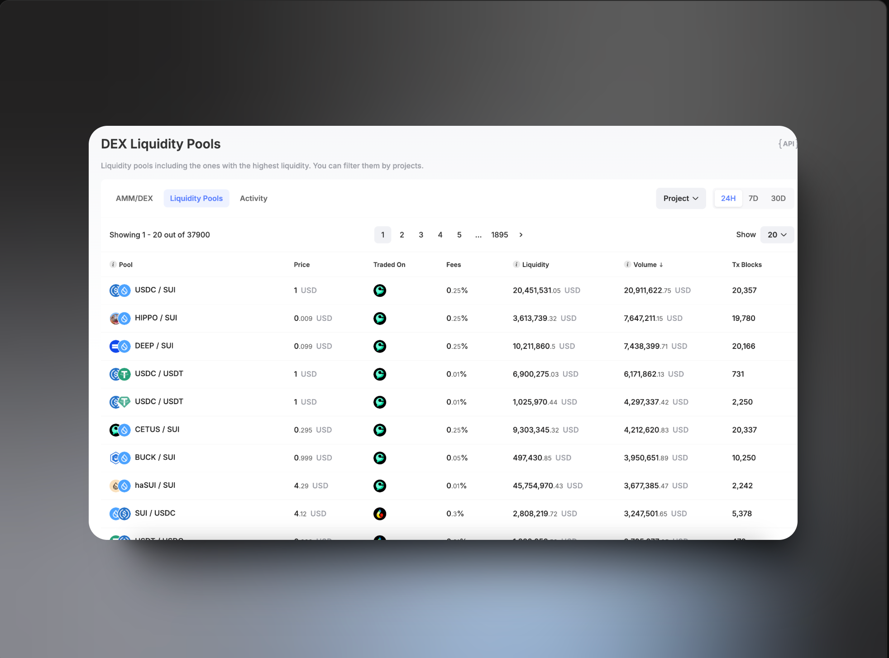

# Liquidity pool là gì ? 

Trong nội dung bài học này, các bạn sẽ được tìm hiểu về defi trong Sui. Nội dung task 5 các bạn cũng thấy là yêu cầu chúng ta làm swap giữa 2 token. Chính vì vậy mà mình muốn cung cấp thêm các thông tin để các bạn hiểu về defi

Liquidity pool trong Sui là một cơ chế cho phép người dùng gộp tài sản của họ vào một smart contract để cung cấp thanh khoản cho các trader swap tokens. Khác với các liquidity pool thông thường, Sui staking pool không dùng liquidity token mà thay vào đó dùng bảng tỷ giá toàn cục để theo dõi kế toán.

Cách hoạt động là ta sẽ có users, những người gọi là **liquidity provider,** có thể  cung cấp hai loại token theo một tỷ lệ nhất định. Tỷ lệ này phải giống với tỷ lệ trong pool để giữ giá trị ổn định giữa hai đồng, nếu không sẽ xảy ra chênh lệch giá.

Liquidity provider sẽ nhận được token *LP* như receipt proofs (một biên nhận) , và chỉ với token này họ mới có thể r**út thanh khoản** (lấy lại hai đồng đã đầu tư). Trader có thể dùng một đồng để đổi lấy đồng khác trong pool.  Mỗi giao dịch sẽ sinh ra một khoản fee (phí) , được chia cho các liquidity provider theo tỷ lệ đóng góp của họ.




Giả định hơn thì LP giống như một voucher và sẽ không store bất kì cái gì bên trong nó. Ví du: 

```rust
public struct LP<phantom COINA, phantom COINB> has drop {}
```

Thành phần quan trọng nhất trong pool chính là **số lượng của hai loại token**, tương tự như mối quan hệ giữa `Coin<SUI>` và `Balance<SUI>`. Ta sẽ dùng `Balance ` để lưu trữ số lượng. 
Vì chúng ta đã đặt ra nhiều ràng buộc cho pool này nên supply trở thành dữ liệu tùy chọn (optional), trong ví dụ bài viết mình viết thì nó phải bằng tổng số lượng của hai đồng. Tuy nhiên, để demo cách sử dụng các hàm liên quan, chúng ta vẫn sẽ thêm dữ liệu này vào đây.

```rust 
public struct Pool<phantom COINA, phantom COINB> has key {
    id: UID,
    balance_a: Balance<COINA>,
    balance_b: Balance<COINB>,
    lp_supply: Supply<LP<COINA, COINB>>,
}
```

Để đảm bảo tính xác thực của token LP mà user nắm giữ, chúng ta sẽ dùng một cấu trúc để lưu trữ thông tin về token này, trong đó ID là khóa (key), `vector<u64>` là giá trị (value) để xây dựng một cấu trúc dữ liệu Table. Trong vector này, giá trị đầu tiên là số lượng của đồng thứ nhất và giá trị thứ hai là số lượng của đồng thứ hai.

```rust
public struct Pocket has key {
    id: UID,
    id_to_vec: Table<ID, vector<u64>>,
}
```


## Ta sẽ tạo các function sau: 

### **Create a liquidity pool:** 

Các hàm chứa generic  cần được liệt kê trong dấu ngoặc nhọn sau tên hàm. Điều quan trọng của hàm này là  **cách tạo một `balance` rỗng, tổng `supply`** và cuối cùng là **share object** dưới dạng có thể thay đổi được( mutable):

```rust 
entry fun create_pool<COINA, COINB>(ctx: &mut TxContext) {

    let pool = Pool<COINA, COINB> {
        id: object::new(ctx),
        balance_a: balance::zero(),
        balance_b: balance::zero(),
        lp_supply: balance::create_supply<LP<COINA, COINB>>(LP<COINA, COINB> {}),
    };

    transfer::share_object(pool);
}
```

### Adding Liquidity

Trong Sui Move, các biến thuộc một type có thể dùng dấu chấm (.) để gọi các function trong module của chúng. Nếu tham số đầu tiên là chính nó, nó sẽ tự động được tham chiếu (reference) hoặc tham chiếu có thể thay đổi (mutable reference) tùy theo ngữ cảnh.

Hai loại token sẽ được đưa vào liquidity pool, và token LP (như một chứng nhận) sẽ được trả về cho liquidity provider. Thông tin liên quan sẽ được lưu trong Pocket.

```rust

entry fun add_liquidity<COINA, COINB>(pool: &mut Pool<COINA, COINB>, coin_a: Coin<COINA>, coin_b: Coin<COINB>, pocket: &mut Pocket, ctx: &mut TxContext) {
    let coin_a_amount = coin_a.value();
    let coin_b_amount = coin_b.value();

    pool.balance_a.join(coin_a.into_balance());
    pool.balance_b.join(coin_b.into_balance());
    let lp_balance = pool.lp_supply.increase_supply(coin_a_amount + coin_b_amount);
    
    let lp_coin = coin::from_balance(lp_balance, ctx);


    let mut vec: vector<u64> = vector<u64>[coin_a_amount, coin_b_amount]

    pocket.id_to_vec.add(object::id(&lp_coin), vec);

    transfer::public_transfer(lp_coin, ctx.sender());
}

```


### Removing Liquidity 

Sử dụng chứng nhận LP mà bạn nắm giữ để rút số lượng tương ứng của hai đồng tiền từ pool. Tất nhiên, chứng nhận này cần được xác thực qua Pocket. Trong phiên bản mới của Sui Move, bạn có thể sử dụng [index] để lấy giá trị, nếu thêm tiền tố & hoặc &mut bạn có thể thực hiện chức năng borrow hoặc borrow_mut.

```rust
entry fun remove_liquidity<COINA, COINB>(pool: &mut Pool<COINA, COINB>, lp: Coin<LP<COINA, COINB>>, pocket: &mut Pocket, ctx: &mut TxContext) {
    let lp_id = object::id(&lp);
    assert!(pocket.id_to_vec.contains(lp_id), ErrNotContainLP);

    let vec = pocket.id_to_vec.remove(lp_id);
    let coin_a_amount = vec[0];
    let coin_b_amount = vec[1];
    assert!(coin_a_amount <= pool.balance_a.value() && coin_b_amount <= pool.balance_b.value(), ErrNotEnoughBalance);

    pool.lp_supply.decrease_supply(lp.into_balance());

    let sender = tx_context::sender(ctx);
    transfer::public_transfer(coin::take(&mut pool.balance_a, coin_a_amount, ctx), sender);
    transfer::public_transfer(coin::take(&mut pool.balance_b, coin_b_amount, ctx), sender);
}
```

### hàm swap a_to_b coin 

Trong bài học này, mình muốn đơn giản về pool nên tỷ lệ sẽ là 1:1. Miễn là trong pool có đủ số lượng đồng tiền tương ứng, việc triển khai hàm rất đơn giản.

```rust 

entry fun a_swap_b<COINA, COINB>(pool: &mut Pool<COINA, COINB>, coin_a: Coin<COINA>, ctx: &mut TxContext) {
    let amount = coin_a.value();
    assert!(amount <= pool.balance_b.value(), ErrNotEnoughBalance);

    pool.balance_a.join(coin_a.into_balance());
    transfer::public_transfer(coin::take(&mut pool.balance_b, amount, ctx), tx_context::sender(ctx));
}

```

# Deploy on chain

Sau khi mình đã dùng lệnh `sui client publish` thì bây giờ mình có thể:

• **Setting Environment Variables**

```rust
export PACKAGE_ID=0xbf3da4e4174fda08f963abf9380e64aedec4d310dbd4a8e03ed4f653c05452ef
export COIN_A_TREASURY_CAP=0x587fbe3bbc2c349750a8f53e9211f6a8ac210191e77d1ef5d71c4b568ec56120
export COIN_B_TREASURY_CAP=0x6c862ef9962fc9942738b32fa8fec7046c0013ece24452a050eae2f6b3409edc
export COIN_A_TYPE=0xbf3da4e4174fda08f963abf9380e64aedec4d310dbd4a8e03ed4f653c05452ef::coin_a::COIN_A
export COIN_B_TYPE=0xbf3da4e4174fda08f963abf9380e64aedec4d310dbd4a8e03ed4f653c05452ef::coin_b::COIN_B
export POCKET=0xdd96634447f2657e360955f7a2497d247288fb8c0dec92214563770361e562f0
export OWNER=0x9e4092b6a894e6b168aa1c6c009f5c1c1fcb83fb95e5aa39144e1d2be4ee0d67(这是你自己的地址，用来接收铸造的币)
```

Đầu tiên liên quan đến tạo Coin: 

```rust
sui client call --package $PACKAGE_ID --module coin_a --function mint --args $COIN_A_TREASURY_CAP 100 $OWNER --gas-budget 10000000
```

Sau khi mình đã tạo xong rồi, mình giờ có thể record đồng coin vào biến môi trường: 

```rust
export COIN_A=0xa9f409565a3a7dd7a58560eeee6865d76e1658c787232ff8d7e2f2fb1226d782
```

Điều tương tự với coin_B: 

```rust
sui client call --package $PACKAGE_ID --module coin_b --function mint --args $COIN_B_TREASURY_CAP 200 $OWNER --gas-budget 10000000
```

Giờ thì mình có thể tạo lệnh creating LP bằng: 

```rust
sui client call --package $PACKAGE_ID --module swap --function create_pool --type-args $COIN_A_TYPE $COIN_B_TYPE --gas-budget 10000000
```