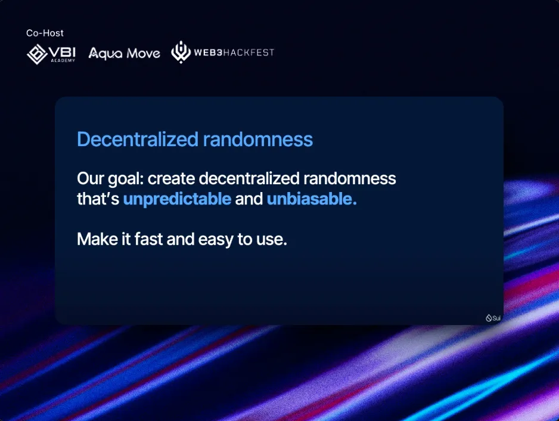
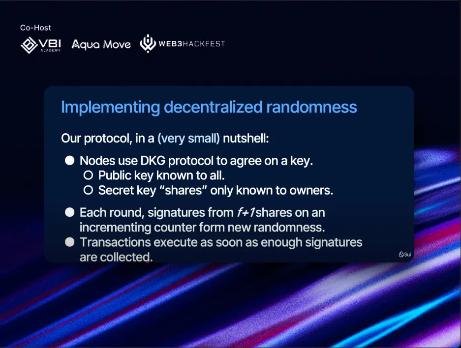
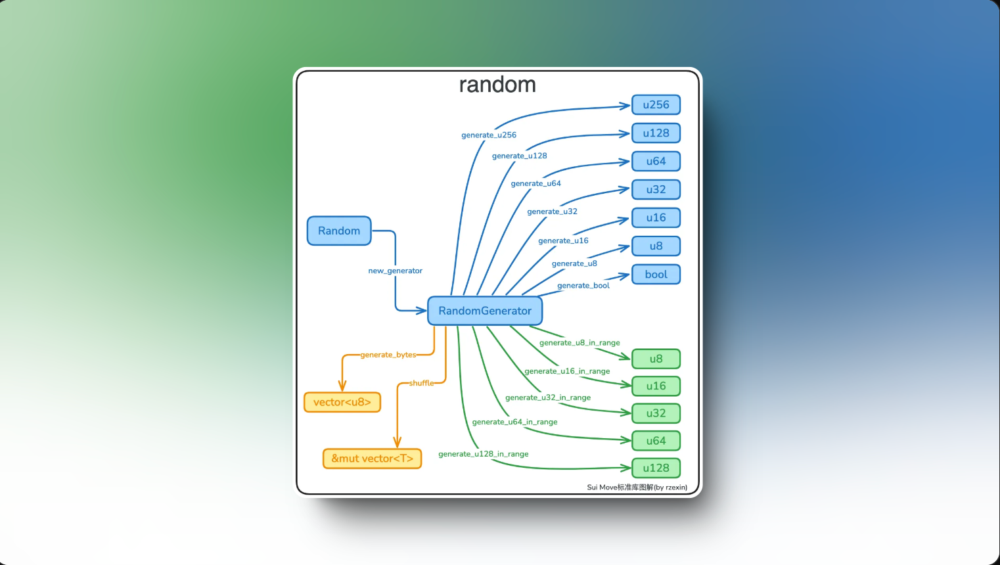

# Giới thiệu về on chain randomness 

Để hiểu về Native randomness trên Sui, bạn có thể xem qua các tài liệu sau: 

1. **Sui Basecamp 2024:** Watch a talk that explains how random numbers work on Sui and what you can do with them: https://www.youtube.com/watch?v=xO1Lyem3PC8



Trong bài video cũng có đề cập đến về behind the randomness có gì: 



Developers giờ đây có thể sử dụng module random mới được gen ra bởi các validator của Sui, và đã có sẵn trên Sui mainnet. Trong buổi chia sẻ ở Sui Base Camp 2024: 

> Sui's onchain randomness is secure, because it is unpredictable and unbiasable.

Nghĩa là: 

* **Tính không thể đoán trước (Unpredictability)** đảm bảo rằng không ai có thể biết trước được giá trị random trước khi nó được sử dụng, ngăn chặn việc attacker có thể lợi dụng front-running transaction hoặc chỉ tham gia khi biết kết quả có lợi cho họ.
* **Tính không thể thiên vị (Unbiasability):** đảm bảo rằng không một bên nào có thể tác động đến quá trình tạo ra số ngẫu nhiên, ngăn chặn attacker có thể thao túng kết quả theo hướng có lợi cho họ.

## Các  **Use Cases cho Onchain Randomness:**

**NFTs::** NFTs có thể sử dụng tính ngẫu nhiên để tạo ra các items độc đáo với các cấp độ hiếm khác nhau. Ví dụ, một bộ sưu tập NFT có thể gán các thuộc tính dựa trên xác suất.

**Games of Chance::** Một số game cần ứng dụng tính ngẫu nhiên on-chain như lottery, game bài, loot boxes, raffles và các game casino như trên [@doubleup_app](https://x.com/doubleup_app) và [@WinX_io](https://x.com/WinX_io). Bằng cách sử dụng tính ngẫu nhiên on-chain, các game này có thể hoạt động mà không cần người chơi phải tin tưởng vào nhà điều hành game. Tính công bằng của các game này có thể được xác minh độc lập, đảm bảo tính minh bạch và tin cậy.

**Contests và Player matching:**

Bao gồm việc xếp ngẫu nhiên người tham gia vào các bảng đấu tournament như trên [@panzerdogs](https://x.com/panzerdogs) và ghép cặp người chơi cho các game và tương tác xã hội, xác định thứ tự chơi trong game turn-based, chọn người chiến thắng trong trường hợp hoà, phân chia người chơi vào các team, v.v.


## Dùng sui::random module




Các function trên đều nằm trong random modules. Tuỳ vào use cases mà bạn mong muốn random đó là int, bool hay bytes.. Ngoài ra đây cũng ví dụ ứng dụng với randome cho lắc xúc sắc: 

```rust 
module cookbook::random{
    use sui::random::{Self, Random, new_generator};
    use sui::event;

    public struct Dice has key, store {
        id: UID,
        value: u8,
    }

    public struct DiceEvent has copy, drop {
        value: u8,
    }

    entry fun roll_dice(r: &Random, ctx: &mut TxContext): u8 {
        let mut generator = new_generator(r, ctx); 
        let result = random::generate_u8_in_range(&mut generator, 1, 6);
        result
    }

    entry fun roll_dice_nft(r: &Random, ctx: &mut TxContext) {
        let value = roll_dice(r, ctx);
        let dice = Dice {
            id: object::new(ctx),
            value,
        };

        event::emit(DiceEvent { value });

        transfer::transfer(dice, tx_context::sender(ctx));
    }
}

```