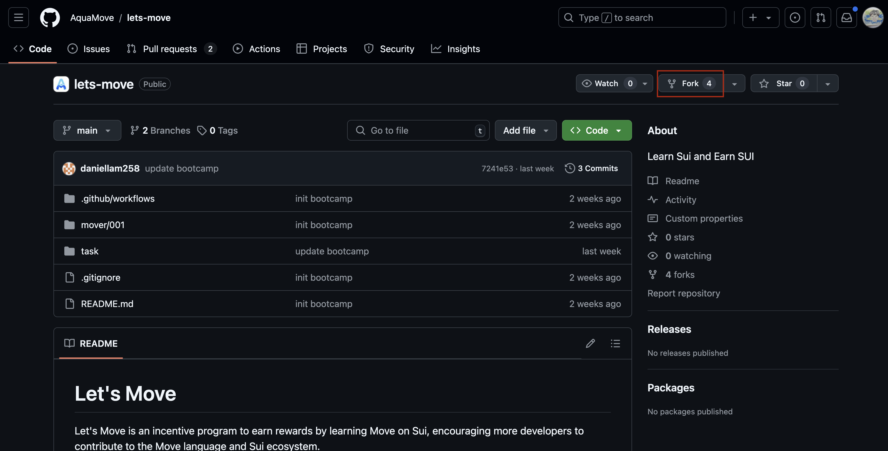
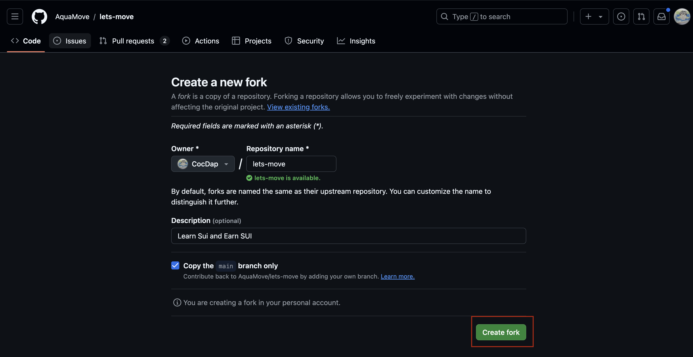
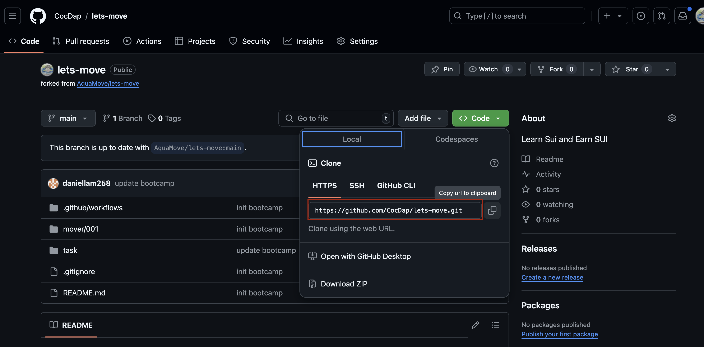
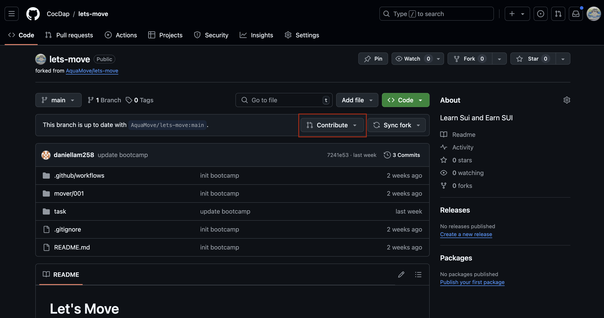

# Nội dung Code Challenge 1

+ Cài đặt Sui Cli
+ Cài đặt Sui wallet 
+ Deploy contract `Hello Move` với nội dung là `Github ID` của bạn


## Cách thức nộp bài 

### Step 1: Fork repo

+ Vào github `https://github.com/AquaMove/lets-move` 
+ Vào `Fork` ở góc trên bên phải 




+ Tạo fork repo 



### Step 2: Git clone fork repo về local machine 




```bash
git clone <link repo bạn đã fork> 
```

### Step 3: Thực hiện các yêu cầu trong file `01_hello_move.move` 

Link yêu cầu: https://github.com/AquaMove/lets-move/blob/main/task/01_hello_move.md


### Step 4: Push code lên fork repo 

+ Sử dụng `git` command để push code lên fork repo 

## Step 5: Raise the PR 



Các bạn có thể tham khảo ví dụ PR này: https://github.com/AquaMove/lets-move/pull/2


### Step 6:Chờ đợi review 


