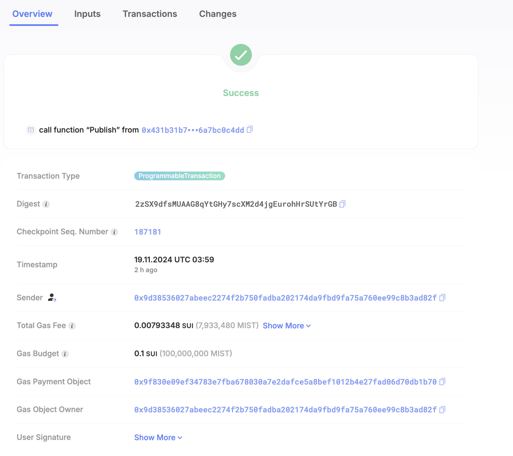
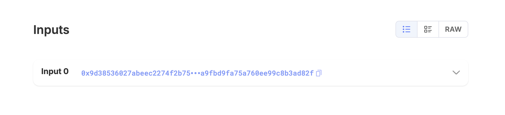
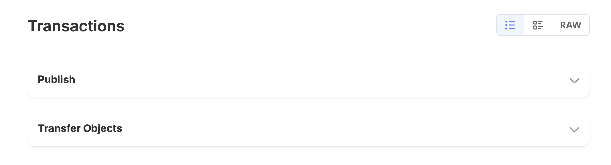
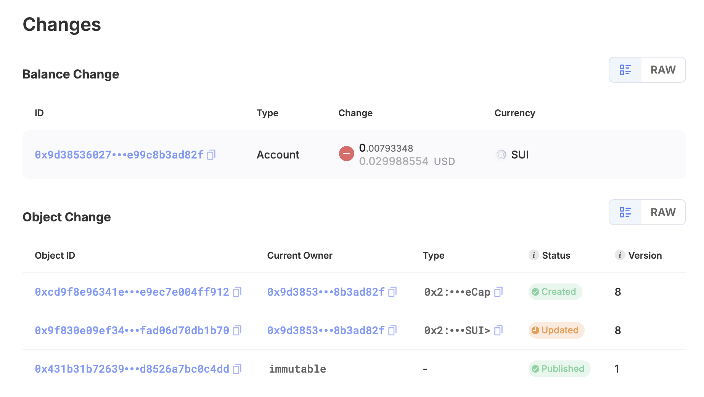
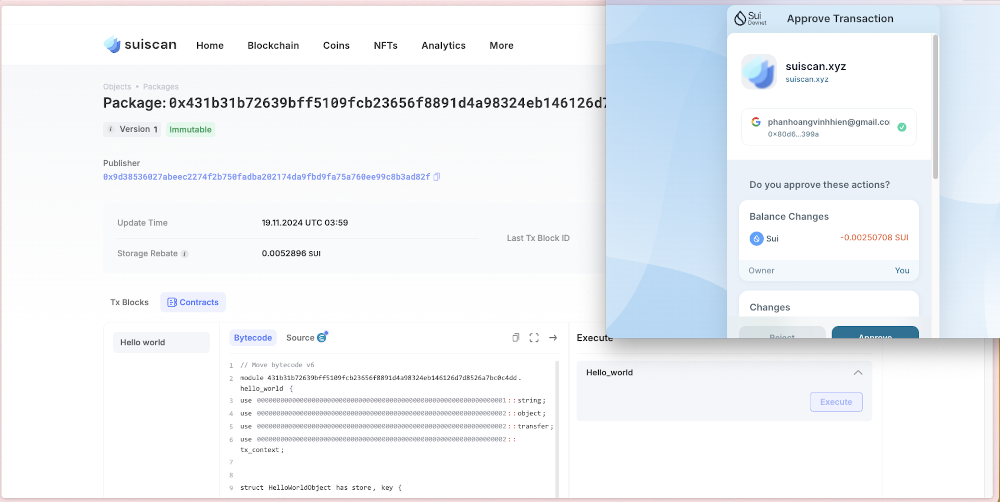

# Suiscan là gì? 

## Mục đích của Suiscan

+ `Tổng quan Blockchain`: Cung cấp dữ liệu thời gian thực về trạng thái blockchain Sui, bao gồm khối lượng giao dịch, tài khoản hoạt động và phí gas.

+ `Theo dõi Giao dịch`: Cho phép người dùng tìm kiếm và giám sát các giao dịch cụ thể, hiển thị chi tiết như trạng thái, địa chỉ liên quan và thời gian giao dịch.

+ `Thông tin Tài khoản`: Cho phép người dùng xem số dư, lịch sử giao dịch và các Object liên quan đến từng tài khoản.

+ `Tương tác Smart Contract`: Hỗ trợ tương tác các smart contract Move đã triển khai, bao gồm mã nguồn, các giao dịch liên quan và các Object liên quan.

+ `Phân tích NFT và DeFi`: Cung cấp thông tin chi tiết về NFT và các ứng dụng tài chính phi tập trung (DeFi) trên mạng lưới Sui.

+ `Dữ liệu Validator và Staking`: Cung cấp thông tin về các validator mạng lưới, thống kê staking và chi tiết epoch.

+ `Analytic`: Hiển thị biểu đồ các chỉ số mạng lưới như khối lượng giao dịch và phí gas theo thời gian, giúp người dùng phân tích xu hướng.

## Xem thông tin transaction digest trên suiscan

### Xem thông tin tổng quan của transaction

- Xem thông tin [Overview](https://suiscan.xyz/devnet/tx/2zSX9dfsMUAAG8qYtGHy7scXM2d4jgEurohHrSUtYrGB)

### Xem input của transaction

### Xem thông tin transactions 

### Xem thông tin các object liên quan 

## Tương tác smart contract trên Suiscan 

Thực hiện transaction `hello_world` trên suiscan: 

## Tài liệu tham khảo 
+ https://suiscan.xyz/
+ https://suivision.xyz/

