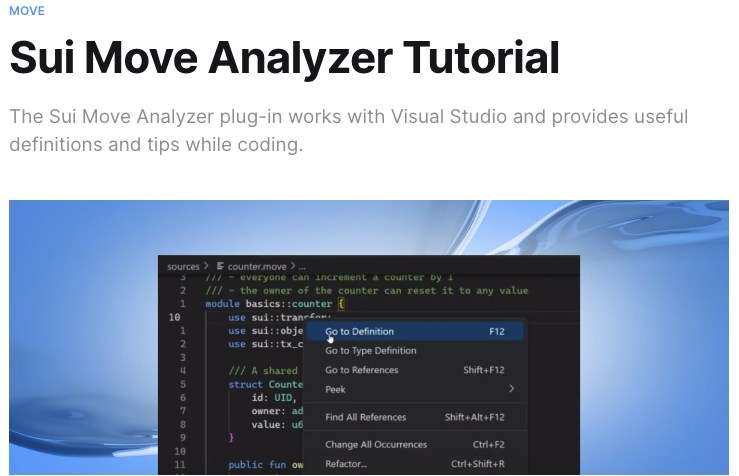
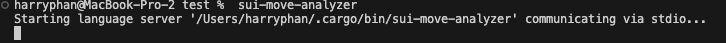
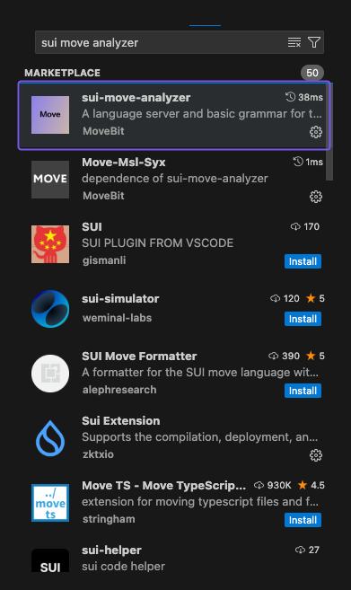
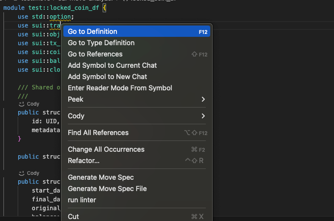
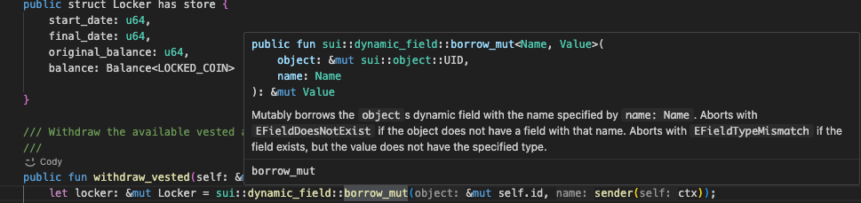
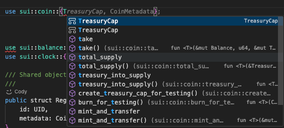
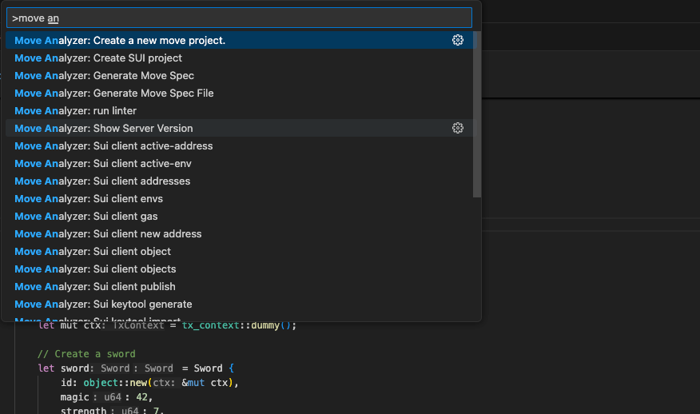
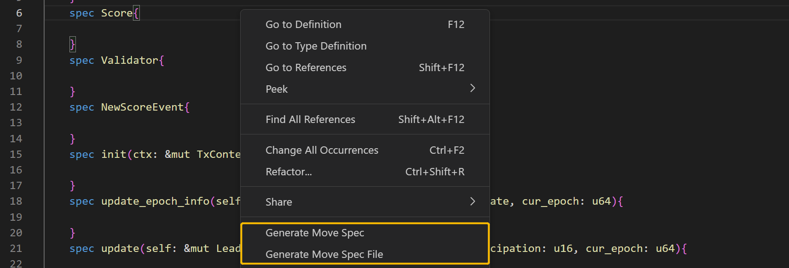

# Sử dụng Sui Move Analyzer (Thêm công cụ cho move coding)

Nếu bạn là người dùng vscode để code Sui move thì đây là một extension hữu ích cho việc cung cấp definitions của các package để mọi người hiểu ý nghĩa của nó





# Cài đặt [sui-move-analyzer](https://marketplace.visualstudio.com/items?itemName=MoveBit.sui-move-analyzer&ref=blog.sui.io)
Các cách tải sui-move-analyzer: 

A. Tải từ file các binaries file bằng cách truy cập vào đây: [sui-move-analyzer](https://github.com/movebit/sui-move-analyzer/releases)<br/>
B. Sử dụng Cargo: 

```bash 
cargo install --git http://github.com/movebit/sui-move-analyzer --branch master sui-move-analyzer
```




C. Cài đặt trực tiếp trên Visual Studio Code extension




# Cách sử dụng sui-move-analyzer

* Trả các definition trong Sui Move

Ví dụ bạn có thể click chuột vào module "sui::transfer" để jump to definition của nó. 

 

* Hover các infor về các functions():



* Auto complete các modules, functions, fields, structs, etc: 




* Create Sui template 


* Coding với MSL 


Sui move analyzer còn hỗ trợ generate  [Move Specification Language (MSL)](https://github.com/move-language/move/blob/main/language/move-prover/doc/user/spec-lang.md?ref=blog.sui.io). MSL được coi là một phần của Move prover, một tool quan trọng cho hỗ trợ các builder trong việc code move chính xác hơn. CÁc builder muốn làm việc trên quy tắc MSL sẽ thấy đây là tool bổ ích

