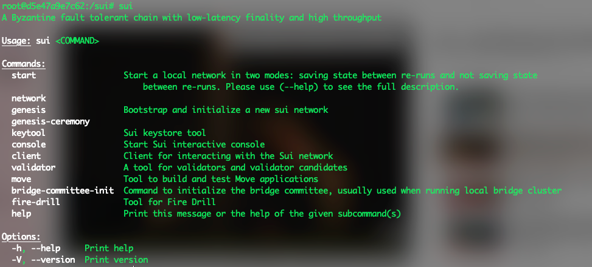
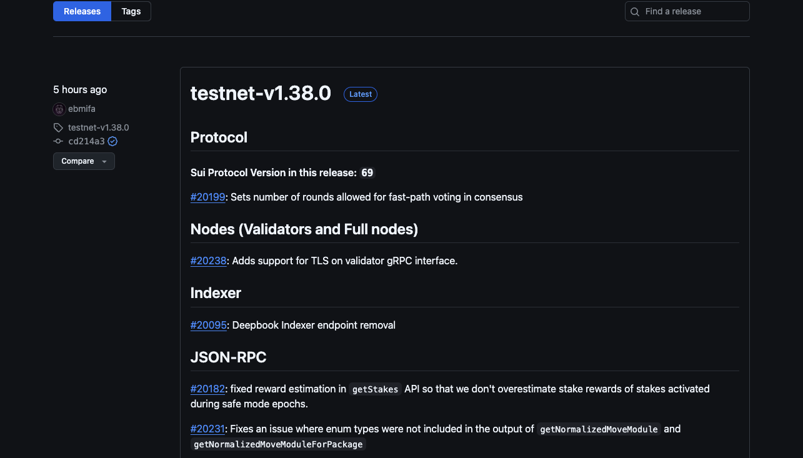
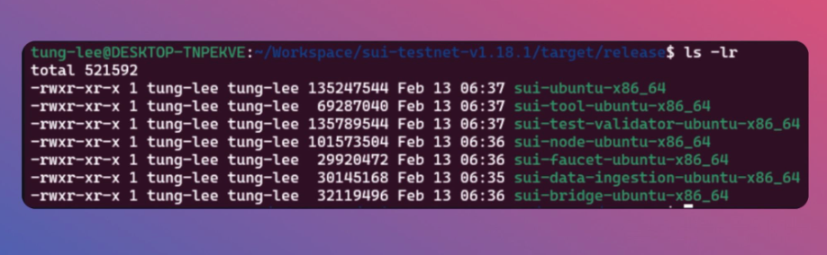
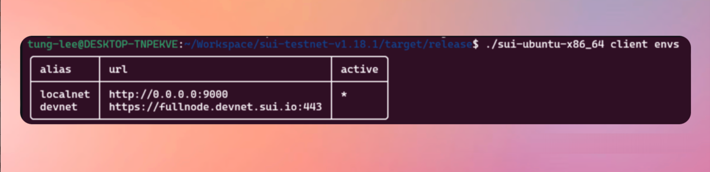

# Set up môi trường Sui trên máy bạn 


## Set up local network 

Có 3 cách để set up local network:
- Chạy docker 
- Tải Binaries file 
- Cài đặt trực tiếp sui cli 

### Làm sao để chạy docker image với Sui binaries 

Step 1: Bạn cần install [Docker](https://docs.docker.com/get-docker/) trên machine của Bạn
Step 2: Pull từ [Official Sui](https://hub.docker.com/r/mysten/sui-tools/tags) Docker image. Bạn có thể xem thêm[ở đây ](https://hub.docker.com/r/mysten/sui-tools/tags).

Đây là các lệnh để thực thi: 

Testnet: 
```bash
docker pull mysten/sui-tools:testnet
```

Devnet: 

```bash
docker pull mysten/sui-tools:devnet
``` 

Chạy Docker container:

```bash
docker run --name suidevcontainer -itd mysten/sui-tools:devnet

docker exec -it suidevcontainer bash
```




### Install Sui Binaries Locally

Mỗi phiên bản Sui cung cấp một tập các binaries cho nhiều OS. Bạn có thể tải xuống các tệp này từ GitHub và sử dụng chúng để cài đặt Sui.




Pros: 
* Sẽ nhanh hơn so với việc cài đặt sui bằng cargo. Với máy linux hồi trước của mình phải mất 30 phút để install sui = Cargo
* Dễ dàng cho control versions

Cons( không hoàn toàn gọi là cons vì có cách vượt qua):
* Khi cần về bạn cần biết cách set up globally => declare environment variable cho sui 


Các bước để cài đặt đó là truy cập vào [đây](https://github.com/MystenLabs/sui/releases) để cài dặt bản sui version mới nhất. 

Nếu bạn dùng WSL, bạn cần chuyển file zip từ windows sang WSL. Mở WSL terminal và chạy lệnh sau: explorer.exe . Lúc này, File explorer sẽ open ra và bạn có thể chọn file zip để copy vào WSL. Sau khi tải file zip xong, bạn có thể giải nén bằng lệnh: 

```
tar -xzvf <filename>.tgz 
``` 

Kết quả sẽ là nhận được 2 file: Target và external-crates. Ta chỉ cần quan tâm đến Target folder 




Ta sẽ thấy các binary files. Tuy nhiên chỉ cần quan tâm đến 2 file là: **sui-ubuntu-x86_64** và **sui-tool-ubuntu-x86_›64**.

Để chạy những file này, bạn chỉ cần xài command: 

```bash
./<binary_filename>
```

Chúng ta đã cài đặt thành công SUI từ các binaries file. Để cập nhật phiên bản SUI trong tương lai, có thể sử dụng phương pháp này để tiết kiệm thời gian. Việc cài đặt bằng cargo có thể mất hơn 30 phút và có thể dẫn đến lỗi.



Để có thể set up environment variable để every time bạn đều có thể dùng sui cli với binaries  thì access vào `.bashrc` file bằng cách dùng nano, vim hay vscode

```bash 
export SUI_TESTNET_HOME="<absolute_path>/target/release"
```

Sau khi saving file, gõ lệnh `source ~/.profile` để lưu những thay đổi


### Install sui cli từ cargo 

[Sui documentation](https://docs.sui.io/guides/developer/getting-started/sui-install) có thể giúp bạn cài đặt với cargo 

Cách dễ nhất để cài đặt Sui là gõ các lệnh sau đây cho Homebrew (MacOS) hoặc Chocolatey (Windows):


```bash

 brew install sui

 # windown :  choco install sui

```

Đối với người dùng Linux, bạn có thể chạy với Cargo. Cargo yêu cầu về rust nên hãy đọc điều kiện [the prerequisites](https://docs.sui.io/guides/developer/getting-started/sui-install#prerequisites) để đảm bảo chạy thành công 

Ví dụ: 
```rust
cargo install --locked --git <https://github.com/MystenLabs/sui.git> --branch testnet sui
```

Quy trình cài này thường có thể tốn nhiều thời gian. 