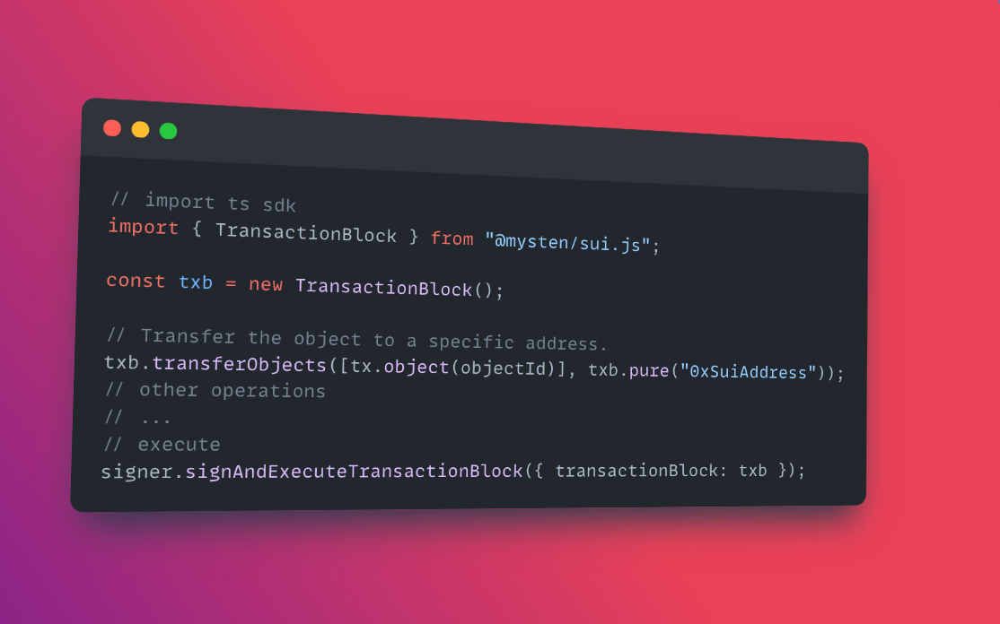

# The key technical innovations

## Object-centric model

Khác với ngôn ngữ smart contract truyền thống, dữ liệu được lưu trữ toàn cục bằng địa chỉ (address) hoặc tên kiểu ( type name) thì Move trên Sui sẽ lưu trữ dữ liệu bằng ID của đối tượng(object). 
Sui sử dụng Object là đơn vị cơ bản để lưu trữ dữ liệu thay vì tài khoản( account ), như thường thấy trên hầu hết các blockchain khác. Trong Move on sui, mỗi object sẽ gắn liền với unique ID, hoàn toàn độc lập với địa chỉ blockchain. 

Ví dụ: chúng ta có một object "CoolAsset" sẽ có ID là "AssetID1234" và  ID này sẽ được lưu trữ trên global storage được tham chiếu( Reference) đến object đó. Các developer có thể define, create và manage các object này mà không cần phải viết các logic phức tạp. Một đối tượng sẽ có các thuộc tính riêng biệt, bao gồm cả tính ownership. Và các giá trị có thể được cập nhập dựa trên logic của smart contract.

Tuy nhiên điểm đặc biệt là mặc dù **smart contract có thể tạo(create) object, nhưng nó không lưu trữ (Store) object đó**

Để hiểu thêm về object, chúng ta cần hiểu về tính ownership của object đó (Chi tiết về objects sẽ được viết sâu hơn ở các phần sau): 

* Owned objects: Đa số các assets trên Sui sẽ được sỡ hữu bởi một single address, được coi như là một data value cho object đó. 

* Shared objects: Ngoài các object được sỡ hữu thì bởi một địa chỉ duy nhât thì còn có thể share với [multiple accounts](https://docs.sui.io/devnet/learn/objects#shared)

* Composable objects: Không chỉ mỗi người là sỡ hữu một object, mà các object cũng có thể sỡ hữu các object khác trên Sui, cho phép tạo một asset mới. 

## Programmable Transaction Blocks 

Khác với các blockchain thông thường  chỉ có là một giao dịch. Thì  PTB có thể được xem như transaction có khả năng  invoke  nhiều functions từ nhiều smart contract hoặc chuyển nhiều objects. Điều này cho phép tương tác với DeFi, mint NFT, hoặc chuyển Assets. 

Đọc chi tiết hơn về PTB [tại đây](https://intro.sui-book.com/unit-five/lessons/1_programmable_transaction_block.html)

## zkLogin và Zk

ZkLogin về cơ bản là framework onboarding việc trải nghiệm giao diện người dùng (UI) tương đương với quá trình đăng nhập hoặc đăng ký của các dịch vụ Web 2.0. Tuy nhiên, khác với Web 2.0 truyền thống, nơi các bên thứ ba sẽ quản lý dữ liệu người dùng, zkLogin cho phép user hoàn toàn sở hữu dữ liệu của họ. 

Để hiểu cách tiếp cận của zkLogin truy cập vào đây: [zklogin](https://docs.sui.io/concepts/cryptography/zklogin) 

