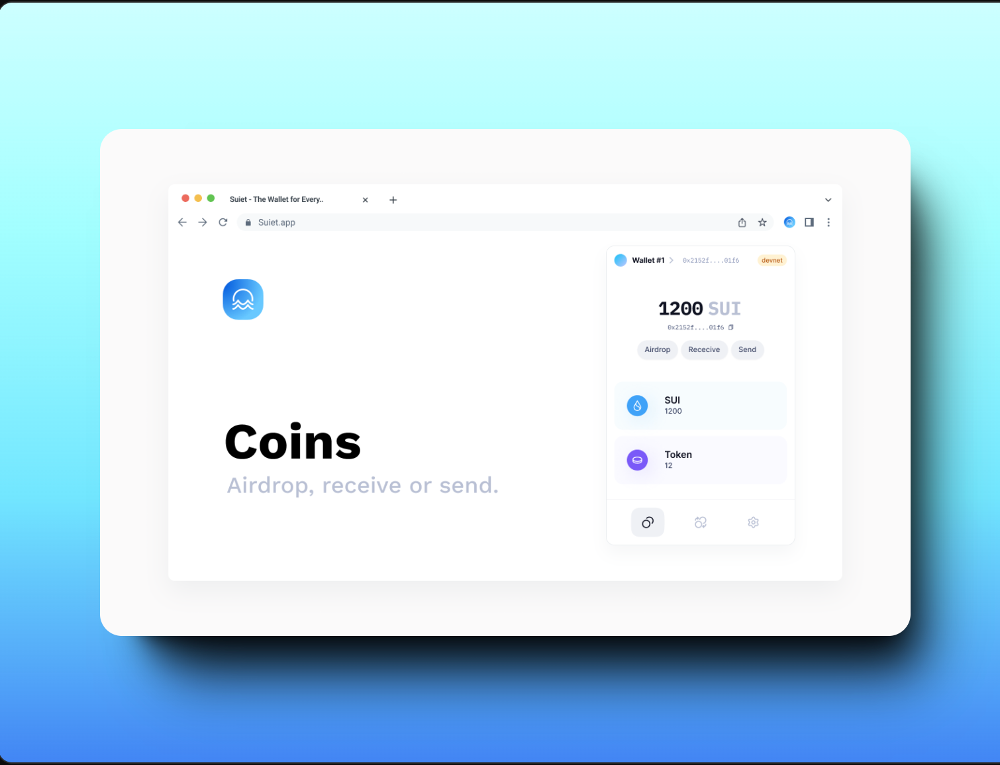

# Installation guide for the SUI wallet extension and faucet

Có nhiều cách để tạo một địa chỉ Sui Address và nhận SUI. Đây là một số cách: 

- Sử dụng [Sui Wallet](https://chrome.google.com/webstore/detail/sui-wallet/opcgpfmipidbgpenhmajoajpbobppdil)

- Sử dụng [Suiet wallet](https://chromewebstore.google.com/detail/suiet-sui-wallet/khpkpbbcccdmmclmpigdgddabeilkdpd) 

- Sử dụng [Stashed Wallet](https://getstashed.com/auth) - web-based blockchain wallet: 
