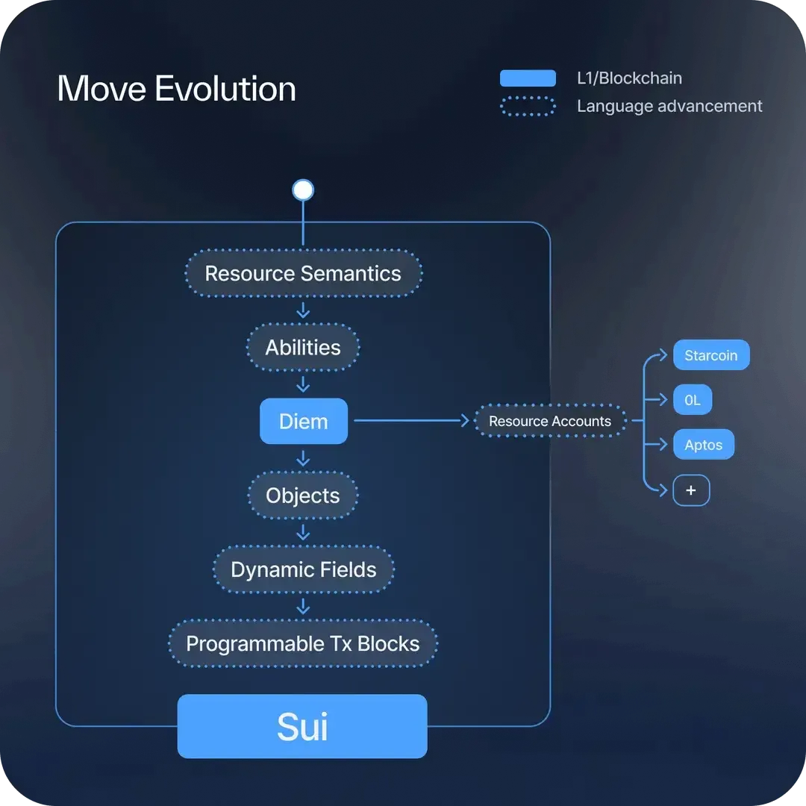

> Trong computing, tất cả mọi thứ chỉ là bits và bytes đều có thể dễ dàng copied. Nhưng chúng ta cần **một ngôn ngữ lập trình có tính quyền sở hữu( ownership) **, tương tự như cách hoạt động của các objects trong thế giới thực. Điều này rất quan trọng vì lý do bảo mật. Đó là lý do tại sao chúng tôi đã tạo ra Move - một ngôn ngữ lập trình mới giải quyết vấn đề này. Các ngôn ngữ lập trình khác, n**gay cả những ngôn ngữ được sử dụng cho các ứng dụng blockchain,** không xử lý vấn đề này. Sui xây dựng Move đặc biệt để giúp các lập trình viên viết code bảo mật hơn, dễ dàng hơn, mà không cần phải tạo ra các giải pháp phức tạp từ đầu **—**  
> 
**Lời văn từ Sam Blackshear -** Creator of the Move programming language, Co-founder of Mysten Labs, Initial Contributor to Sui ( https://blog.sui.io/power-of-sui-move/ )


<br/>

Như giới thiệu từ section 1, Move, ban đầu được phát triển bởi Meta, là một ngôn ngữ lập trình được thiết kế cho **blockchain** và **smart contracts**, khởi đầu để **hỗ trợ dự án Libra** (sau đổi tên thành Diem). Thiết kế và triển khai của Move chịu ảnh hưởng từ ngôn ngữ Rust và có các kiểu dữ liệu nguyên thủy (primitive types) và mảng (arrays). Theo **Sam Blackshea**r - creator của Move lang, ngôn ngữ Move giải quyết các vấn đề sau: 

- **Tính sở hữu và  khan hiếm(Ownership và Scarcity)**: Move cung cấp các trừu tượng (abstractions) cần thiết để biểu diễn bits và bytes trong máy tính, giúp chúng có tính chất sở hữu và khan hiếm như các vật thể trong thế giới thực.
- **Đảm bảo Bảo mật**: Move được thiết kế với các đảm bảo bảo mật cơ bản, cho phép dev viết code an toàn và hiệu quả mà không cần phải "phát minh lại bánh xe".
- **Hệ thống Kiểu Resource**: Hệ thống kiểu resource đảm bảo các tài nguyên không thể bị sao chép hoặc xóa bỏ và chỉ có thể được quản lý thông qua các transfer được phép.

Move trên Sui là ngôn ngữ lập trình smart contract được phát triển bởi Mysten Labs cho blockchain Sui. Đây là phiên bản cải tiến của Move, được thiết kế để tích hợp với mô hình dữ liệu hướng đối tượng của Sui.

Sơ đồ dưới đây sẽ  thể hiện sự tiến hoá của ngôn ngữ Move: 




## Các thành phần của một object trong object-centric data model?

**Resource-Oriented Design Concept:** Sự độc đáo của Sui nằm ở thiết kế hướng tài nguyên (resource-oriented). Thiết kế này xem các tài nguyên **on-chain** như những objects có thể quản lý độc lập, cho phép sử dụng hiệu quả và quản lý chính xác các tài nguyên.

- **Objects**: Trong Sui, mỗi tài nguyên on-chain được xem như một object. Các objects này có thể là **tokens**, **smart contracts**, **NFTs**, hoặc các loại tài sản khác.
- **State và lifecycle của Objects**: Mỗi object có state và lifecycle riêng. Trạng thái của object có thể được thay đổi bởi các transactions hoặc smart contracts, trong khi vòng đời của nó định nghĩa quá trình tạo, sử dụng và hủy object đó.

<br/> 

Trong Sui, tất cả các transactions đều yêu cầu objects làm input và tạo ra các objects mới hoặc đã được chỉnh sửa làm output. Mỗi object lưu trữ hash của transaction cuối cùng đã tạo ra nó. Những objects có thể được sử dụng làm input được gọi là "active" objects. Bằng cách quan sát các active objects này, chúng ta có thể hiểu được trạng thái hiện tại của toàn bộ blockchain: 

- **Unique Identifier (objectId):** Mỗi object có một định danh duy nhất để phân biệt với các objects khác. ID này được tạo ra khi object được khởi tạo và không thể thay đổi (immutable)
- **Object Type (objType)**: Mỗi object có một kiểu xác định cấu trúc và hành vi của nó.
- **Owner (owner)**: Mỗi object gắn với một chủ sở hữu có quyền kiểm soát object đó. Trên Sui, objects có thể được sở hữu bởi một tài khoản, được chia sẻ giữa tất cả tài khoản, hoặc bị đóng băng - chỉ cho phép truy cập đọc mà không được sửa đổi hay transfer.
- **Version**: Mỗi khi object thay đổi trong Sui, một số phiên bản mới được tạo ra, đóng vai trò như một số ngẫu nhiên để ngăn chặn các tấn công DDOS.
- **Digest**: Mỗi object có một digest - một hash của dữ liệu object. Digest được dùng để xác minh tính toàn vẹn của dữ liệu object và đảm bảo nó không bị can thiệp. Digest được tính khi object được tạo và được cập nhật khi dữ liệu object thay đổi.

```bash
... 
│  ┌──                                                                                             │
│  │ ObjectID: 0xf23a5e0ab3f054ac8762ef9b09d8b118f5168cc6c2a49a253f49a4cfeed50923                  │
│  │ Sender: 0xd51d17a672dfd63b91c1c555542f8151126f5e0872b85553644730c2471fdf28                    │
│  │ Owner: Account Address ( 0xb2ff9d4b13077deecb7e03e2041772abcbe4b7720f413f84264c60384cf29b5c ) │
│  │ ObjectType: 0x2::coin::Coin<0x2::sui::SUI>                                                    │
│  │ Version: 268743490                                                                            │
│  │ Digest: 3FnjZrvBfZSMGLNLUDLeEH2yuLtrdbcRdYzfRy7m2Dfx                                          │
│  └──   
...   
```


