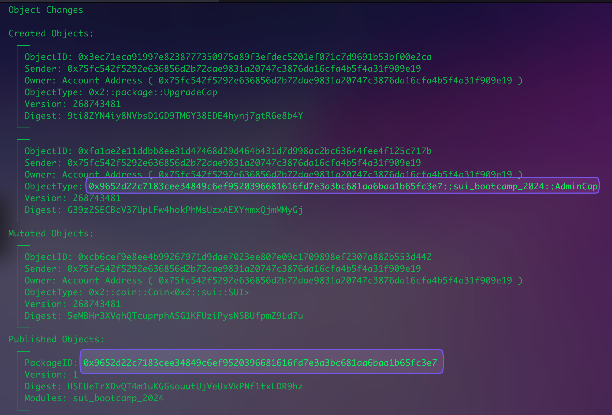
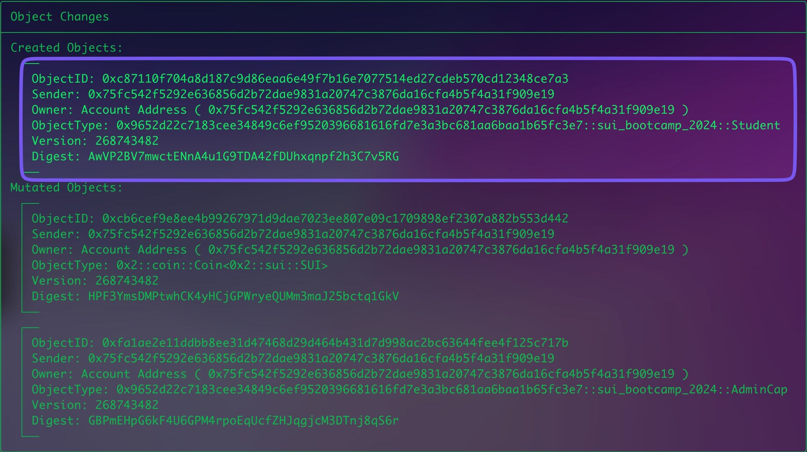

# Capability Pattern cho Object Authorization

+ Capability là một kiểu pattern trong ngôn ngữ lập trình Move. 
+ Nó giúp kiểm soát việc ai được phép sử dụng các objects trong chương trình. Lấy ví dụ mình muốn tạo một quyền teacher object mà chỉ có object đó mới có quyền quyền thay đổi bảng điểm học sinh. . 

+ Khi muốn tạo một capability object mà không thể chuyển cho người khác( giống như soulbound token) , chúng ta chỉ cần bỏ qua thuộc tính store trong struct.

```rust
struct TeacherCap has key {
    id: UID
  }
```

💡Note: Cách làm này giống với cách tạo soulbound tokens (SBT) trong Move - bạn chỉ cần tạo một struct có thuộc tính key mà không có thuộc tính store..

Sau khi sở hữu Object `TeacherCap` thì ta có thể dùng trong function để bất kỳ ai có object đó mới có thể gọi được:

```rust
public fun create_wrappable_transcript_object(_: &TeacherCap, history: u8, math: u8, literature: u8, ctx: &mut TxContext) {
    let wrappableTranscript = WrappableTranscript {
        id: object::new(ctx),
        history,
        math,
        literature,
    };
    
    
    transfer::transfer(wrappableTranscript, tx_context::sender(ctx))
}
```

Chúng ta truyền tham số với reference của object `TeacherCap` đó và dùng underscore(_) để ký hiệu là tham số này không được sử dụng. Nhớ là bạn chỉ đang tham chiếu đó tới object.


-> Như vậy mọi người đã hiểu tầm quan trọng của việc dùng Capability rất quan trọng cho quyền access control với các object. Pattern này sẽ cung cấp một cách flexible hợn. Nếu bạn vẫn chưa hiểu Capability là gì ? 

Thì bạn có thể coi nó giống như bạn muốn vào cửa nhà thì bạn phải có chìa khoá(key) , capability object sẽ giống như chìa khoá của bạn cấp quyền để bạn có thể vào được nhà( truy cập và thực thi các function được) 


## Address check và sử dụng Capability thì nên dùng cái gì ? 

Khi lập trình blockchain, việc sử dụng objects như capabilities là một khái niệm khá mới với các bạn bởi vì ở các ngôn ngữ smart contract khác, việc xác thực này thường được thực hiện bằng cách check địa chỉ của người gửi. Kiểu:

```rust
if(address) { //code nè }
```

Pattern như thế  cũng có thể áp dụng trong Sui, tuy nhiên việc bạn sử dụng capability objects được khuyến khích hơn vì tính bảo mật và code sẽ được tổ chức tốt hơn.

```rust
// Ví dụ nếu dùng kiểu address check 
public fun new(ctx: &mut TxContext): User {
    assert!(ctx.sender() == APPLICATION_ADMIN, ENotAuthorized);
    User { id: object::new(ctx) }
}


// còn khi dùng Capability pattern 

public fun new(_: &AdminCap, ctx: &mut TxContext): User {
    User { id: object::new(ctx) }
}

```

Như vậy bạn sẽ thấy sử dụng capabilities có nhiều ưu điểm:

- Quản lý quyền dễ dàng hơn vì chúng đều là objects.
- Yêu cầu rõ ràng cần có **AdminCap**.
- Không cần kiểm tra thêm trong function body, giảm khả năng dev mắc lỗi.
- Capabilities giúp dễ dàng kiểm tra quyền hạn, vì người dùng có thể xem quyền admin của họ thông qua ví hoặc trình duyệt, minh bạch hơn so với việc check địa chỉ.

## Code ví dụ: 

### Step 1: Tạo thêm 1 address mới (cần 2 account) 

```bash
sui client new-address ed25519
╭─────────────────────────────────────────────────────────────────────────────────────────────╮
│ Created new keypair and saved it to keystore.                                               │
├────────────────┬────────────────────────────────────────────────────────────────────────────┤
│ alias          │ friendly-agates                                                            │
│ address        │ 0x75fc542f5292e636856d2b72dae9831a20747c3876da16cfa4b5f4a31f909e19         │
│ keyScheme      │ ed25519                                                                    │
│ recoveryPhrase │ trash rigid enlist law state aspect blanket stadium material frog cost zoo │
╰────────────────┴────────────────────────────────────────────────────────────────────────────╯
```

Sau đó nhớ switch sang address khác: 

```bash
sui client switch --address friendly-agates 

//hoac la 
---
sui client switch --address 0x75fc542f5292e636856d2b72dae9831a20747c3876da16cfa4b5f4a31f909e19

// nho dung lenh nay de co coin ( neu ban dang o devnet / testnet)  
sui client faucet 
--- 
```

Mình sẽ tạo một đoạn code sau trong sui bootcamp cho những ai là học sinh: 
```rust
module hack_camp::sui_bootcamp_2024 {
		
		use sui::object::{Self, UID};
		use sui::tx_context;
		use std::string::String;
		use sui::transfer;
		
    public struct Student has key {
        id: UID,
        name: String,
    }

		/// quyền admin mới tạo một sudent 
    public struct AdminCap has key, store { id: UID }

    /// Tạo admin khi publish contract
    fun init(ctx: &mut TxContext) {
        transfer::transfer(
            AdminCap { id: object::new(ctx) },
            ctx.sender()
        )
    }
    
    /// Tạo student 
    public entry fun new(_: &AdminCap, name: String, ctx: &mut TxContext) {
        let student = Student {
            id: object::new(ctx),
            name,
        };

        transfer::transfer(student, ctx.sender());
    }
}
```

Sau đó mình chạy lệnh này: 


```bash
sui client publish --gas-budget 100000000

// result
---
╭─────────────────────────────────────────────────────────────────────────────────────────────────────────────────╮
│ Object Changes                                                                                                  │
├─────────────────────────────────────────────────────────────────────────────────────────────────────────────────┤
│ Created Objects:                                                                                                │
│  ┌──                                                                                                            │
│  │ ObjectID: 0x3ec71eca91997e8238777350975a89f3efdec5201ef071c7d9691b53bf00e2ca                                 │
│  │ Sender: 0x75fc542f5292e636856d2b72dae9831a20747c3876da16cfa4b5f4a31f909e19                                   │
│  │ Owner: Account Address ( 0x75fc542f5292e636856d2b72dae9831a20747c3876da16cfa4b5f4a31f909e19 )                │
│  │ ObjectType: 0x2::package::UpgradeCap                                                                         │
│  │ Version: 268743481                                                                                           │
│  │ Digest: 9ti8ZYN4iy8NVbsD1GD9TM6Y38EDE4hynj7gtR6e8b4Y                                                         │
│  └──                                                                                                            │
│  ┌──                                                                                                            │
│  │ ObjectID: 0xfa1ae2e11ddbb8ee31d47468d29d464b431d7d998ac2bc63644fee4f125c717b                                 │
│  │ Sender: 0x75fc542f5292e636856d2b72dae9831a20747c3876da16cfa4b5f4a31f909e19                                   │
│  │ Owner: Account Address ( 0x75fc542f5292e636856d2b72dae9831a20747c3876da16cfa4b5f4a31f909e19 )                │
│  │ ObjectType: 0x9652d22c7183cee34849c6ef9520396681616fd7e3a3bc681aa6baa1b65fc3e7::sui_bootcamp_2024::AdminCap  │
│  │ Version: 268743481                                                                                           │
│  │ Digest: G39z2SECBcV37UpLFw4hokPhMsUzxAEXYmmxQjmMMyGj                                                         │
│  └──                                                                                                            │
│ Mutated Objects:                                                                                                │
│  ┌──                                                                                                            │
│  │ ObjectID: 0xcb6cef9e8ee4b99267971d9dae7023ee807e09c1709898ef2307a882b553d442                                 │
│  │ Sender: 0x75fc542f5292e636856d2b72dae9831a20747c3876da16cfa4b5f4a31f909e19                                   │
│  │ Owner: Account Address ( 0x75fc542f5292e636856d2b72dae9831a20747c3876da16cfa4b5f4a31f909e19 )                │
│  │ ObjectType: 0x2::coin::Coin<0x2::sui::SUI>                                                                   │
│  │ Version: 268743481                                                                                           │
│  │ Digest: 5eMBHr3XVqhQTcuprphASG1KFUziPysNSBUfpmZ9Ld7u                                                         │
│  └──                                                                                                            │
│ Published Objects:                                                                                              │
│  ┌──                                                                                                            │
│  │ PackageID: 0x9652d22c7183cee34849c6ef9520396681616fd7e3a3bc681aa6baa1b65fc3e7                                │
│  │ Version: 1                                                                                                   │
│  │ Digest: HSEUeTrXDvQT4m1uKGGsouutUjVeUxVkPNf1txLDR9hz                                                         │
│  │ Modules: sui_bootcamp_2024                                                                                   │
│  └──                                                                                                            │
╰─────────────────────────────────────────────────────────────────────────────────────────────────────────────────╯
```





```
// Call the contract
sui client call --package 0x9652d22c7183cee34849c6ef9520396681616fd7e3a3bc681aa6baa1b65fc3e7 \
--module sui_bootcamp_2024 --function new \
--args 0xfa1ae2e11ddbb8ee31d47468d29d464b431d7d998ac2bc63644fee4f125c717b "hien" \
--gas-budget 100000000


```




Như vậy đã thành công, nhưng nếu bạn dùng một account khácvaf call function thì sẽ bị báo lỗi 


Mình sẽ có một challenge để các bạ có thể luyện tập như sau: Bạn sẽ tạo một hệ thống quản lý điểm học sinh với các chức năng:
1. Tạo một `TeacherCap` để chỉ giáo viên mới có quyền thay đổi điểm
2. Struct `Student` cần có các thông tin: id, name và grade
3. Chỉ người có `TeacherCap` mới có thể:
- Tạo mới học sinh
- Cập nhật điểm cho học sinh

hint:

```rust

module sui_bootcamp::grade_management {

    use sui::object::{Self, UID};
    use sui::tx_context::{Self, TxContext};
    use sui::transfer;
    use std::string::String;

    struct TeacherCap has key { 
        id: UID 
    }

    struct Student has key, store {
        id: UID,
        // define here 
    }

    // TODO: Implement functions:
    // 1. init()
    // 2. new_student()
    // 3. update_grade()
}
```

Yêu cầu chi tiết:
1. Hoàn thiện các functions còn thiếu
2. Đảm bảo chỉ TeacherCap mới có quyền tạo và cập nhật thông tin


## Nếu muốn thêm một admin nữa cho một địa chỉ khác thì làm sao?
Thì bạn có thể viết một function để gửi 1 object AdminCap cho người đó. Ví dụ nếu mình muốn có thêm một giáo viên nữa thì: 
```rust 

    public fun add_additional_teacher(_: &TeacherCap, new_teacher_address: address, ctx: &mut TxContext){
        transfer::transfer(
            TeacherCap {
                id: object::new(ctx)
            },
        new_teacher_address
        )
    }

```