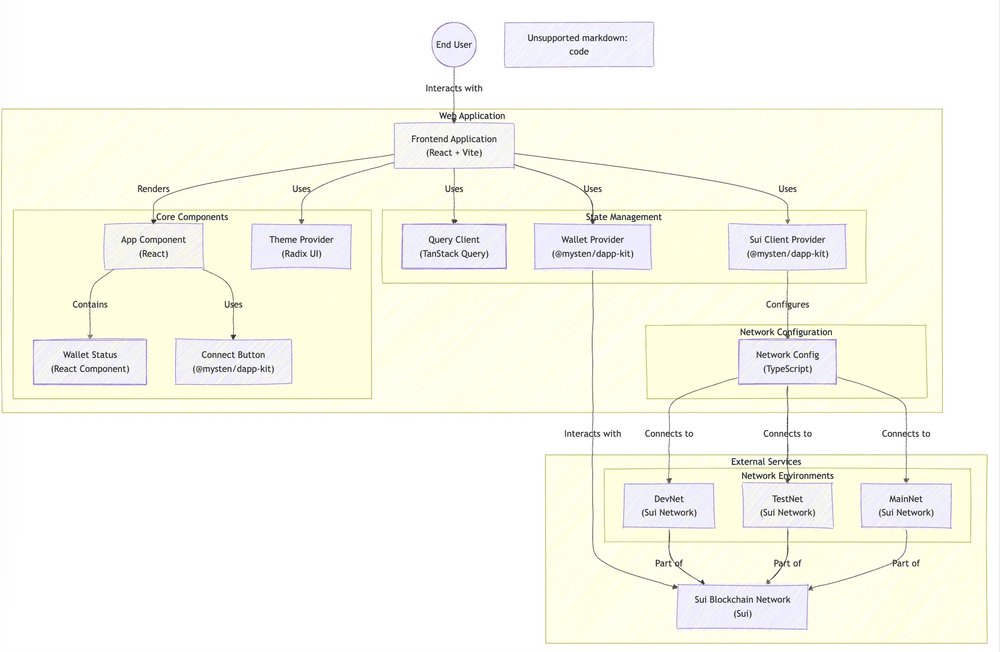
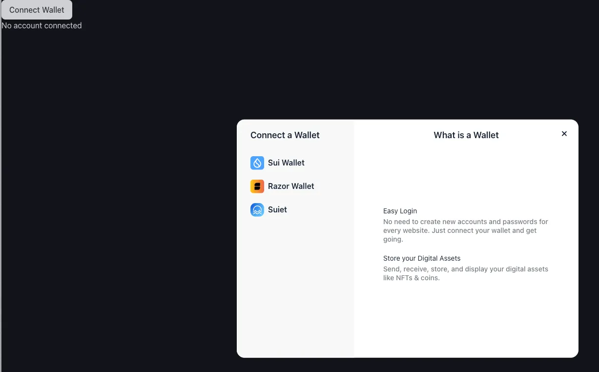
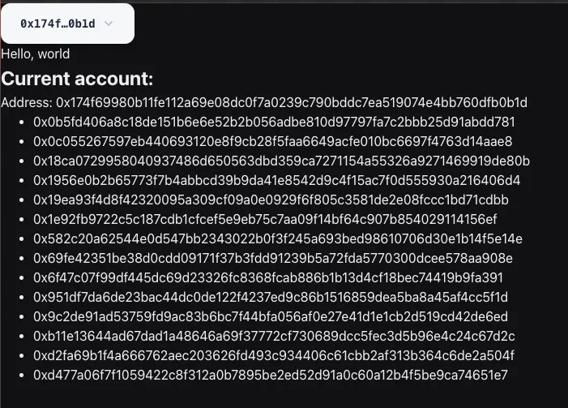

# Giới thiệu Sui-dapp kit 

> Làm thế nào để call on-chain method thông qua SDK để tương tác với contract ?

Mình sẽ sử dụng câu lệnh sau: 
```rust 
pnpm create @mysten/dapp 
```

Khi dùng lệnh trên thì bạn sẽ có có 2 option là:

```rust
? Which starter template would you like to use? …
> react-client-dapp React Client dApp that reads data from wallet and the blockchain
  react-e2e-counter React dApp with a move smart contract that implements a distributed counter
```

Giải thích đơn giản thì: 

- react-client-dapp: Một dApp React cơ bản để lấy danh sách các object mà ví đã kết nối sở hữu.
- react-e2e-counter: Một ví dụ end-to-end bao gồm cả code Move và UI cho một ứng dụng đếm số đơn giản.

Trong ví dụ làm task 4, mình chỉ cần dùng `react-client-dapp` là đủ. Đây là cấu trúc





Sau khi cài đặt các package cần thiết, bạn cần setup một số providers trong ứng dụng để đảm bảo dApp Kit hoạt động trơn tru:

```typescript 
import React from "react";
import ReactDOM from "react-dom/client";
import "@mysten/dapp-kit/dist/index.css";
import "@radix-ui/themes/styles.css";


import { SuiClientProvider, WalletProvider } from "@mysten/dapp-kit";
import { QueryClient, QueryClientProvider } from "@tanstack/react-query";
import { Theme } from "@radix-ui/themes";
import App from "./App.tsx";
import { networkConfig } from "./networkConfig.ts";

const queryClient = new QueryClient();

ReactDOM.createRoot(document.getElementById("root")!).render(
  <React.StrictMode>
    <Theme appearance="dark">
      <QueryClientProvider client={queryClient}>
        <SuiClientProvider networks={networkConfig} defaultNetwork="testnet">
          <WalletProvider autoConnect>
            <App />
          </WalletProvider>
        </SuiClientProvider>
      </QueryClientProvider>
    </Theme>
  </React.StrictMode>,
);


```

## Interface Layout

### Connecting to wallet 

Button này có thể được import từ package `@mysten/dapp-kit`. Bằng cách sử dụng component ConnectButton với cú pháp `<ConnectButton />`, nó sẽ render ra một button dùng để kết nối với ví trình duyệt. Để tùy chỉnh layout của button này, ta có thể wrap nó trong một thẻ `<div> </div>` và styling thông qua className trong file css.

```typescript
import { ConnectButton } from "@mysten/dapp-kit";

function App() {
  const account = useCurrentAccount();
  return (
    <div>
			<ConnectButton />
		
      {!account && <div>No account connected</div>}

			{account && (
				<div>
          <section>Hello, world</section>
					<h2>Current account:</h2>
					<div>Address: {account.address}</div>
          <OwnedObjects /> 
				</div>

			)}
		</div>
  );
}

```





###  Lấy Data

dApp Kit cũng hỗ trợ việc lấy dữ liệu  cho người dùng đang kết nối. Hook `useSuiClientQuery` có thể được sử dụng để gọi các phương thức RPC. Bạn có thể dùng `getOwnedObjects` để truy cập và hiển thị danh sách các object mà tài khoản đang kết nối sở hữu: 

```typescript
export function OwnedObjects() {
	const account = useCurrentAccount()!;
	const { data } = useSuiClientQuery('getOwnedObjects', 
    { owner: account.address });

  if (!data){
    return null;
  }

	return (
		<ul>
			{data.data.map((object) => (
				<li key={object.data?.objectId}> {object.data?.objectId}</li>
			))}
		</ul>
	);
}
```

Và đây là kết quả: 




### Transaction Building

Nhiều dApp cần có khả năng tạo và ký các transaction block. dApp Kit giúp đơn giản hóa quá trình này với hook `useSignAndExecuteTransactionBlock`. Mình sẽ tạo một button để gửi SUI đến một địa chỉ được định nghĩa trước:

```typescript
import { useSignAndExecuteTransaction, useCurrentAccount } from '@mysten/dapp-kit';
import { Transaction } from '@mysten/sui/transactions';

export function SendSui() {
	const { mutateAsync: signAndExecuteTransactionBlock } = useSignAndExecuteTransaction();

	function sendMessage() {
		const txb = new Transaction();

		const coin = txb.splitCoins(txb.gas, [10]);
		txb.transferObjects([coin], '0x915c2d19ee5fde257693f25e6c2cabb04c25e7ae03932817d52e122258c88ddb');

		signAndExecuteTransactionBlock({
			transaction: txb,   
		}).then(async (result) => {
			alert('Sui sent successfully');
		});
	}

	return <button onClick={() => sendMessage()}>Send me Sui!</button>;
}
```

Khi nhấn button, nó sẽ:

- Tạo một `TransactionBlock` mới
- Thêm giao dịch `splitCoins` để tách một lượng SUI từ gas coin thành một coin mới
- Thêm giao dịch `transferObject` để chuyển coin mới đó tới một địa chỉ khác
- Ký và thực thi `TransactionBlock` thông qua ví đã kết nối
- Hiển thị một `alert` để thông báo khi giao dịch đã được thực hiện xong
